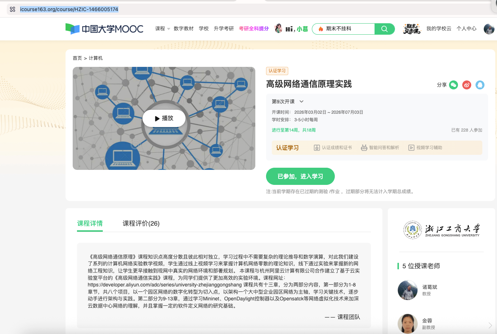
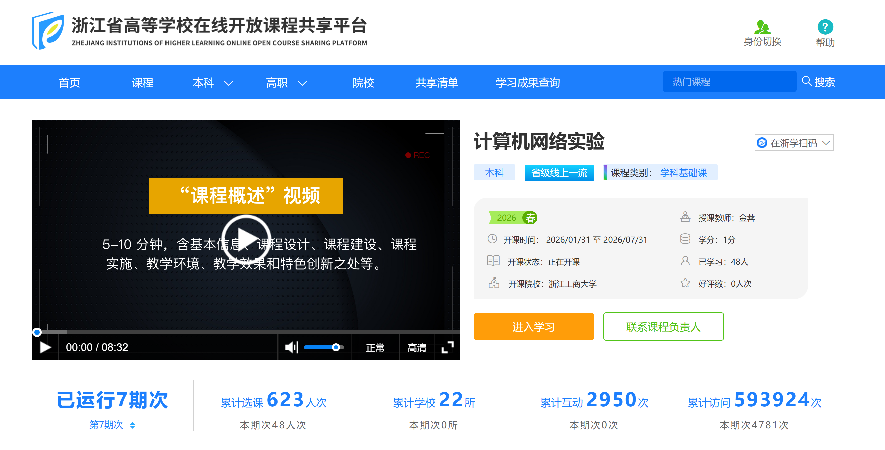
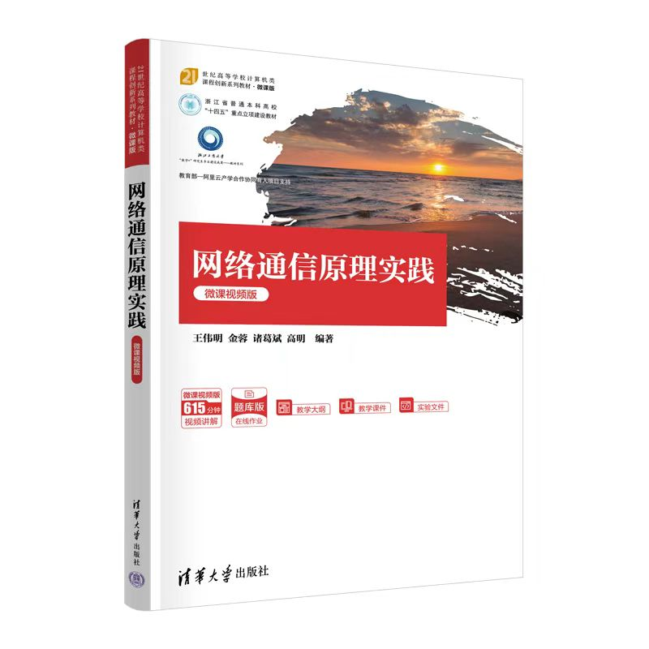

# 浙江省"101 计划"课程建设 | 计算机网络：AI 原生教学范式的探索与实践

> **导读**：当传统课程遇上 AI 革命，会发生什么？浙江工商大学计算机网络课程团队给出了答案——不是简单的技术叠加，而是一场从"知识灌输"到"AI 应用实践"的范式重构。

---

## 01 课程团队：一支"老中青"结合的战斗队伍

*图：第一次研讨会现场，团队成员正在讨论课程建设方案*

2026 年 6 月 1 日，浙江工商大学计算机网络"101 计划"课程建设团队召开了第一次研讨会。这支由**诸葛斌**教授领衔的团队，成员包括金蓉（副教授）、高明（副教授/系主任）、李传煌（教授/部长）、蒋献（实验师），是一支"老中青"结合、理论与实践并重的战斗队伍。

**团队分工明确：**
- **诸葛斌**：课程负责人，统筹全局
- **金蓉**：实验课程负责人，省级线上一流课程主讲人
- **高明**：教材编写牵头人
- **李传煌**：校企合作联络人
- **蒋献**：教学资源开发与技术支撑

---

## 02 现有成果：厚积薄发的坚实底座

### 📚 理论课程：中国大学 MOOC

**《高级网络通信原理实践》**
- 平台：中国大学 MOOC
- 学习人数：228 人（本期）
- 课程进度：第 14 周/共 18 周
- 课程结构：十三章（1-8 章园区网络，9-13 章网络虚拟化）
- 特色：与阿里云计算有限公司合作建立云实验室平台

*图：中国大学 MOOC《高级网络通信原理实践》课程页面*

###  实验课程：省级线上一流课程

**《计算机网络实验》**
- 平台：浙江省高等学校在线开放课程共享平台
- 标签：**省级线上一流课程**
- 负责人：金蓉
- 运行期次：**7 期**
- 累计选课：**623 人次**
- 覆盖高校：**22 所**
- 累计访问：**593,924 次**

*图：浙江省在线开放课程共享平台《计算机网络实验》课程页面*

> **亮点**：一门实验课程，59 万次访问，覆盖 22 所高校，这是怎样的影响力？

### 📖 教材建设：清华出版社重磅出品

**《网络通信原理实践（微课视频版）》**
- 出版社：清华大学出版社
- 作者：王伟明、金蓉、诸葛斌、高明
- 出版时间：2024 年 9 月
- 特色：微课视频版，615 分钟视频讲解
- 系列：21 世纪高等学校计算机类课程创新系列教材

**《系统级编程及分布式应用实现技术》**
- 出版社：清华大学出版社
- 作者：李传煌、金蓉、姜国新、时磊、马博、诸葛斌
- 状态：已定稿，预计 2026 年初出版

---

## 03 101 计划：一场教育范式的革命

### 🎯 核心定位

> **"未来课程建设的关键不再是知识传授，而是培养学生对 AI 生成内容的判断力。"**
> —— 诸葛斌

这不是简单的技术升级，而是一场**从"知识灌输"到"AI 应用实践"的范式重构**。

**传统模式** vs **AI 原生模式**：

| 维度 | 传统模式 | AI 原生模式 |
|------|---------|------------|
| 教学目标 | 知识传授 | AI 应用能力培养 |
| 学生角色 | 被动接受者 | 主动创造者 |
| 教师角色 | 内容传授者 | 引导者与质量把关者 |
| 作业形式 | 书面答题 | AI 生成可视化内容 |
| 评价标准 | 完成度 | 生成质量与理解深度 |

###  五大改革举措

**1️⃣ 协议机制可视化**
- 利用 Manus 等 AI 工具生成动态动画
- 涵盖 STP、路由查找、CHAP、ACL、NAT、TCP 三次握手、OpenFlow 等核心协议
- **学生主导**：学生使用 AI 生成，教师筛选最优作品

**2️⃣ 课程专属私有知识库机器人**
- 整合教材、课件、习题、FAQ
- 提供个性化辅导
- 24 小时在线答疑

**3️⃣ 全流程智慧教学管理**
- MOOC 慕课堂 + 钉钉 AI 助理
- 课前 - 课中 - 课后全流程覆盖
- 数据驱动的教学改进

**4️⃣ 智能体辅助实验新范式**
- AI 辅助生成命令 + 人工专业排错 + 真实设备部署
- 保留真实交互逻辑，AI 辅助概念理解
- **关键原则**：AI 不替代实验操作，而是辅助理解

**5️⃣ 智能体驱动的课程门户建设**
- 课程官网
- 教学资源 + 实验案例 + 优秀作品 + 智能互动
- 媒体化表达，超越传统 PPT 和教材

---

## 04 创新实践：学生作业即课程资源

### 💡 SDP 课程实践经验

**核心方法**：将知识点拆解为学生作业任务，按效果筛选最佳方案

**操作流程**：
1. **知识点拆解**：将课程知识点拆解为学生作业任务
2. **学生实践**：学生使用 AI 工具生成可视化内容（动画、讲解等）
3. **效果筛选**：按效果优劣筛选最佳实现方案
4. **资源库建设**：形成可复用的知识点资源库

> **关键原则**：每知识点选三个最优作品，资源建设须面向推广复用

### 🎓 期末汇报 AI 化

**本学期期末汇报 PPT 交由 AI 自动生成课程总结**

- 提升效率与呈现质量
- 体现 AI 原生课程管理思路
- 教师从内容制作中解放，聚焦质量把关

### 🔄 AI 迭代思维

> **"对'垃圾但可用'内容的容忍度极高，先有粗糙产出，再通过筛选与反馈闭环逐步提纯价值。"**

- 不要求一次性完美
- 关键看是否具备通过持续优化提升效果的潜力
- "找两个好作品"比"让所有人做对"更重要

---

## 05 建设目标：可复制、可推广的"AI+ 教育"典型案例

### 📅 时间节点

| 时间 | 里程碑 | 交付物 |
|------|--------|--------|
| **2026.06** | 知识体系初稿 | 50-60 个关键知识点文档 |
| **2026.07** | 教材样章 + 实验案例 | 样章 2 章 + 实验案例 5 个 |
| **2026.08** | 协议动画 + 知识库机器人 | 动画 5 个 + 机器人 MVP |
| **2026.09** | 全部交付物初稿 | 初稿汇总 |
| **2026.10** | 中期总结材料 | 总结报告 |
| **2026.11-12** | 中期工作总结 | 质量标准制定 |
| **2027.12** | 验收认定 | 核心课程 + 教材 + 实践项目 + 师资团队 |

###  预期成效

- ✅ 形成协议动画库 + 课程专属私有知识库机器人
- ✅ 更新出版配套数智化教材
- ✅ 实验效率提升 40%+，每学期受益 200+ 学生
- ✅ 打造"101 计划"本地化"AI+ 教育"典型案例
- ✅ **可复制、可推广**：形成系统化、高质量的课程资源库

---

## 06 未来展望：五年后专业教育将全面重构

> **"未来五年内传统专业与课程可能消亡，教育核心应转向培养学生对 AI 生成内容的判断力与批判性思维。"**
> —— 诸葛斌

**这不是危言耸听，而是正在发生的现实。**

当 AI 可以生成高质量的动画、讲解、代码时，传统的"知识传授"还有多少价值？当学生可以用 AI 工具完成作业时，教师的角色应该如何转变？

**答案很明确：**
- 教师从"内容传授者"转变为"AI 应用的引导者与质量把关者"
- 学生从"被动接受者"转变为"主动创造者"
- 教育从"知识灌输"转变为"判断力与批判性思维培养"

> **"教师需先相信 AI 的潜力，才能调整教学策略；是否能实现不重要，重要的是是否愿意探索与验证。"**

---

## 07 团队心声：一场教育实验的开始

**诸葛斌**：
> "我们不是在做一个普通的课程建设项目，而是在探索未来教育的可能性。五年后，当我们的学生走上工作岗位，他们需要的是什么？不是死记硬背的知识，而是运用 AI 工具解决复杂问题的能力。"

**金蓉**：
> "实验课程运行 7 期，59 万次访问，22 所高校使用。这让我们看到了优质教学资源的价值。现在，我们要做的不仅是延续，更是升级——用 AI 赋能，让实验课程更加智能化、个性化。"

**高明**：
> "教材编写不是简单的知识堆砌，而是要思考：在 AI 时代，学生需要什么样的教材？我们的答案是：数智化教材，配套视频、动画、交互资源，让学生可以'活学活用'。"

---

## 08 结语：信念先行，探索不止

**这不是终点，而是起点。**

计算机网络"101 计划"课程建设团队，正站在教育变革的潮头。他们相信：

- **信念先行**：先相信 AI 的潜力，才能调整教学策略
- **学生驱动**：以学生作业创新为驱动，构建课程建设素材库
- **媒体化表达**：展示效果需超越传统 PPT 和教材
- **面向推广**：资源建设须避免杂糅堆砌，形成系统化资源库
- **迭代思维**：对"垃圾但可用"内容保持高容忍度，通过筛选与反馈闭环逐步提纯价值

**五年后，当我们回望今天，或许会发现：这场教育范式的重构，正是从这一刻开始的。**

---

**项目信息**
- 项目名称：计算机网络（模块一，本科，专业核心课）
- 负责人：诸葛斌（浙江工商大学）
- 建设周期：2026.01 - 2027.12
- 支持单位：浙江省"CS&AI 101 计划"工作组

**联系方式**
- 课程链接：[中国大学 MOOC](https://www.icourse163.org/course/HZIC-1466005174)
- 实验课程：浙江省高等学校在线开放课程共享平台
- 教材购买：清华大学出版社

---

*本文由虾尔 AI 助手自动生成，体现 AI 原生课程管理思路*

*编辑：虾尔 | 审核：诸葛斌 | 发布日期：2026 年 6 月 1 日*
