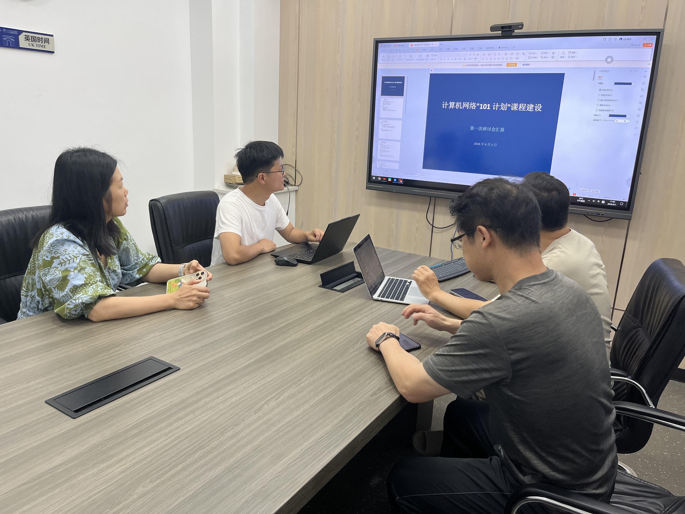

# 计算机网络"101 计划"课程建设 · 第一次研讨总结报告

**会议时间：** 2026 年 6 月 1 日 11:02-11:26
**会议形式：** 线下会议 + 钉钉群协作
**会议地点：** 浙江工商大学会议室
**参会人员：** 诸葛斌、金蓉、高明、李传煌、蒋献
**记录人：** 虾尔 AI 助手（诸葛斌团队）
**报告日期：** 2026 年 6 月 1 日

---

## 会议现场

*图：第一次研讨会现场，参会人员正在听取 PPT 汇报*

---

## 一、会议背景

本次会议围绕 AI 工具在课程教学中的应用展开，重点探讨如何利用"小螃蟹""小龙虾"等 AI 助手生成教学材料、改革作业形式，并重构课程设计逻辑。诸葛斌提出核心目标：**未来课程建设的关键不再是知识传授，而是培养学生对 AI 生成内容的判断力**，并强调当前所有教学工作应服务于探索 AI 与教育融合的可行性。

---

## 二、核心指导思想

### （一）课程定位转型

**从"知识灌输"转向"AI 应用的实践场景"**

- 课程不再是教学核心，而是 AI 工具应用的背景场景
- AI 工具（如 Manus）应作为学生自主实践载体，而非教师代劳
- 教师应聚焦于如何利用 AI 提升教学效率与学生能力培养

### （二）教育目标

**不是"能否做出"，而是"是否达到教育效果"**

- 展示效果需超越传统 PPT 和教材，追求媒体化表达高度
- 核心仍在于教育实效而非形式美观
- 课程未来定位应转向 AI 原生教学范式

### （三）未来展望

**五年后专业教育将全面重构**

- 本科生与研究生教学逻辑趋同
- 教育核心应转向培养学生对 AI 生成内容的判断力与批判性思维
- 教师需先相信 AI 的潜力，才能调整教学策略

---

## 三、会议讨论要点

### （一）AI 工具在课程中的应用模式

#### 1. 作业形式改革

| 议题 | 讨论要点 | 结论 |
|------|---------|------|
| **知识点自动化生成** | 如何改革作业形式？ | 要求学生使用 AI 为每个知识点生成讲解材料（如动画、文档），作为日常作业 |
| **成果筛选机制** | 如何评估学生作业？ | 教师从全班提交的 AI 生成内容中挑选出 3 个最佳版本，纳入课程资源库 |
| **价值评判权转移** | 评价标准是什么？ | 由教师主观评价转为学生作品实际质量驱动——"交一百份作业，只要有两份超出想象，就是成功" |

#### 2. 实验课适配性讨论

| 议题 | 讨论要点 | 结论 |
|------|---------|------|
| **实验课 AI 应用** | AI 是否适合实验课？ | 当前 AI 适合用于理论课的知识点呈现，但直接嵌入实验课存在难度 |
| **理论 + 实验结合** | 如何平衡？ | 实验前半部分涉及理论知识，可结合 AI 生成内容辅助理解；后半部分操作性内容仍需传统方式支撑 |

#### 3. 教学目标重构

| 议题 | 讨论要点 | 结论 |
|------|---------|------|
| **核心目的** | 教学的核心目标是什么？ | 不是让学生掌握具体课程内容，而是通过课程场景训练其熟练使用 AI 工具的能力 |
| **终极判断标准** | 如何评估 AI 教学效果？ | 不在于 AI 能否完成任务，而在于"花更多时间后是否能做得更好" |
| **风险与判断力** | AI 辅助教学的风险？ | 若缺乏判断力，盲目部署 AI 生成内容可能导致错误累积。教学重点应转向如何正确引导和评估 AI 输出结果 |

### （二）教学资源与课程建设方向

#### 1. 现有资源状态

- 已有研究生团队基于 SDP 等案例进行过初步尝试，部分内容已在微信群共享
- 当前 AI 生成内容整体质量参差，从专业角度看"完全是不靠谱的""是垃圾"，但视觉表现优于传统 PPT 和教材

#### 2. 建设目标升级

- 不满足于"看上去漂亮"，希望推动 AI 生成内容达到更高媒体化水平，具备对外展示和推广价值
- 鼓励创新性探索，例如引导学生提出"颠覆想象的好奇想法"，而非仅完成标准化输出

#### 3. 国际化适配考虑

- 英方教学材料同步需额外处理，流程更复杂，但方向一致：即用 AI 重构教学表达形式

### （三）课程组织与分工调整

#### 1. 教学主导权让渡

- 诸葛斌表示希望将整门课程交由他人主导，"下学期我会上你想上的东西"
- 未来课程规划由"小熊"统筹协调，相关讨论在钉钉群内通过@"小龙虾"等方式推进

#### 2. 跨层级教学统一性

- 研究生与本科生课程本质趋同，均应转向以 AI 工具使用为核心的训练模式
- 强调五年内所有专业和课程可能被 AI 重塑，"纠结课程有没有意义已无必要"

### （四）AI 工具使用实操与技术支持

#### 1. 操作方式说明

- 在钉钉群内可直接@"小龙虾"发起对话，或与其私聊处理敏感内容
- 私聊适用于不愿公开讨论的任务，确保灵活性

#### 2. 技术保障情况

- 当前 AI 算力充裕，"怎么折腾都没关系"
- 所购套餐性价比高，靠和续费顺利，支持长期使用

#### 3. 使用体验反馈

- 初期存在操作障碍（如鼠标晃动影响录屏），但可通过垫鼠标垫等方式改善
- 生成效率极高，例如将期末汇报 PPT 批量投喂给 AI，可自动生成高质量课程总结

---

## 四、实践案例与经验

### SDP 课程实践

**核心方法：** 将知识点拆解为学生作业任务，按效果筛选最佳方案

| 步骤 | 内容 |
|------|------|
| 1. 知识点拆解 | 将课程知识点拆解为学生作业任务 |
| 2. 学生实践 | 学生使用 AI 工具生成可视化内容（动画、讲解等） |
| 3. 效果筛选 | 按效果优劣筛选最佳实现方案 |
| 4. 资源库建设 | 形成可复用的知识点资源库 |

**关键原则：**
- 每知识点选三个最优作品
- 资源建设须面向推广复用，避免杂糅堆砌
- 以媒体化表达高度呈现，超越传统 PPT 和教材

### 期末汇报 AI 化

**本学期期末汇报 PPT 交由 AI 自动生成课程总结**

- 提升效率与呈现质量
- 体现 AI 原生课程管理思路
- 教师从内容制作中解放，聚焦质量把关

---

## 五、会议决议

### 决议一：AI 融入教学的核心目标

- **内容：** 以课程为场景，训练师生使用 AI 工具的能力，最终实现教育资源的 AI 原生重构
- **负责人：** 诸葛斌
- **配合人：** 全体
- **时间节点：** 2026 年 9 月

### 决议二：学生作业转型

- **内容：** 要求学生使用 AI 为每个知识点生成讲解材料（如动画、文档），作为日常作业
- **负责人：** 金蓉
- **配合人：** 蒋献
- **时间节点：** 2026 年 9 月

### 决议三：成果筛选与资源库建设

- **内容：** 教师从全班提交的 AI 生成内容中挑选出 3 个最佳版本，纳入课程资源库
- **负责人：** 诸葛斌
- **配合人：** 全体
- **时间节点：** 课程建设周期内完成

### 决议四：实验课 AI 应用探索

- **内容：** 探索 AI 在实验课中与仿真平台结合的可能性
- **负责人：** 金蓉
- **配合人：** 蒋献
- **时间节点：** 持续探索

### 决议五：期末汇报 AI 化

- **内容：** 本学期期末汇报 PPT 交由 AI 自动生成课程总结
- **负责人：** 虾尔 AI 助手
- **配合人：** 诸葛斌
- **时间节点：** 2026 年 7 月

---

## 六、关键原则总结

| 序号 | 原则 | 说明 |
|------|------|------|
| 1 | **AI 工具定位** | Manus 等作为学生自主实践载体，非教师代劳 |
| 2 | **实验课与理论课分离** | 实验课不应直接由 AI 替代仿真平台操作，但 AI 可用于辅助概念理解 |
| 3 | **人机协同决策** | 引导学生部署前验证生成结果，提升判断力 |
| 4 | **学生驱动创新** | 组织学生组队提交 AI 生成作业，人工筛选优质成果 |
| 5 | **媒体化表达** | 展示效果需超越传统 PPT 和教材 |
| 6 | **面向推广复用** | 资源建设须避免杂糅堆砌，形成系统化资源库 |
| 7 | **教育实效优先** | 核心在于教育实效而非形式美观 |
| 8 | **信念先行** | 教师需先相信 AI 的潜力，才能调整教学策略 |
| 9 | **峰值发现机制** | "找两个好作品"比"让所有人做对"更重要 |
| 10 | **迭代思维** | 对"垃圾但可用"内容的容忍度极高，先有粗糙产出，再通过筛选与反馈闭环逐步提纯价值 |

---

## 七、下一步行动计划

| 序号 | 任务 | 负责人 | 时间节点 |
|------|------|--------|----------|
| 1 | 整理本次研讨会完整纪要 | 虾尔 AI 助手 | 2026-06-01 |
| 2 | 更新任务分工表（融入 AI 原生理念） | 虾尔 AI 助手 | 2026-06-01 |
| 3 | 更新 6 月行动计划（增加学生作业创新驱动） | 虾尔 AI 助手 | 2026-06-01 |
| 4 | 更新 PPT（更新核心改革方向） | 虾尔 AI 助手 | 2026-06-01 |
| 5 | 提交工作组备案 | 金蓉 | 2026-06-05 |
| 6 | 布置学生使用 AI 生成各知识点讲解材料 | 相关任课教师 | 已开始执行 |
| 7 | 在钉钉群内组织 AI 教学试验并@"小龙虾"协作 | 小熊、金蓉等 | 持续进行 |
| 8 | 汇总每个知识点的三个最佳 AI 生成成果 | 教师团队 | 课程建设周期内完成 |
| 9 | 探索 AI 在实验课中与仿真平台结合的可能性 | 金蓉等 | 持续探索 |

---

## 八、会议金句

> "未来课程建设的关键不再是知识传授，而是培养学生对 AI 生成内容的判断力。"
> —— 诸葛斌

> "不是'能否做出'，而是'是否达到教育效果'。"
> —— 诸葛斌

> "教师需先相信 AI 的潜力，才能调整教学策略；是否能实现不重要，重要的是是否愿意探索与验证。"
> —— 诸葛斌

> "未来五年内传统专业与课程可能消亡，教育核心应转向培养学生对 AI 生成内容的判断力与批判性思维。"
> —— 诸葛斌

> "交一百份作业，只要有两份超出想象，就是成功。"
> —— 诸葛斌

> "纠结课程有没有意义已无必要。"
> —— 诸葛斌

---

## 九、AI 洞察

本次会议标志着从"AI 辅助教学"向"教学服务于 AI 能力培养"的范式逆转，课程本身成为 AI 应用的试验场。

对"垃圾但可用"内容的容忍度极高，反映出一种典型的 AI 迭代思维：先有粗糙产出，再通过筛选与反馈闭环逐步提纯价值。

"找两个好作品"比"让所有人做对"更重要，预示未来教育评价体系或将从均值导向转向峰值发现机制。

---

**报告撰写：** 虾尔 AI 助手（诸葛斌团队）
**报告审核：** 诸葛斌
**报告日期：** 2026 年 6 月 1 日
