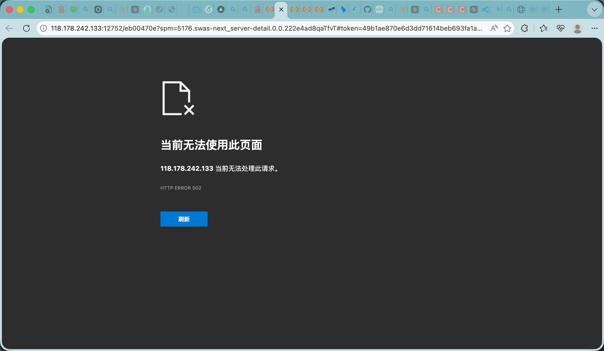
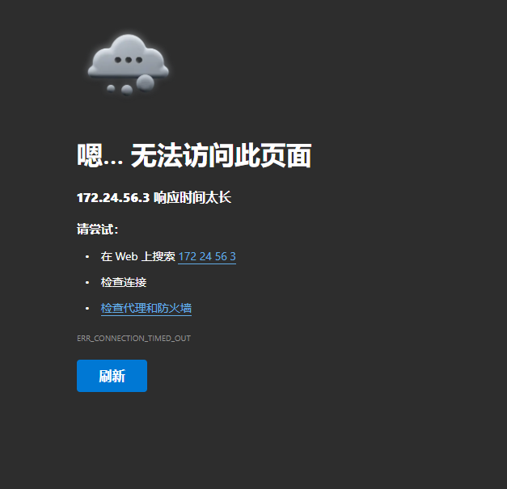

# 📝 实验报告：AI 智能体辅助前端项目开发

---

## 一、实验基本信息

| 项目 | 内容 |
|------|------|
| **实验名称** | AI 智能体辅助前端项目开发实践 |
| **实验人员** | 阳婧 |
| **指导教师** | 诸葛斌 |
| **实验时间** | 2026 年 4 月 14 日 20:46 - 21:28 |
| **实验时长** | 42 分钟 |
| **智能体** | 小龙虾（OpenClaw AI 助手） |

---

## 二、实验目的

1. **掌握 AI 智能体辅助开发流程** - 体验从需求分析到项目交付的完整流程
2. **实践前端项目开发** - 完成一个多页面响应式旅游指南网站
3. **学习公网部署方案** - 掌握 Vercel/Netlify/GitHub Pages 等部署方式
4. **验证 AI 协作效率** - 评估 AI 辅助开发的质量和效率

---

## 三、实验环境

| 类别 | 配置 |
|------|------|
| **开发平台** | OpenClaw AI 智能体平台 |
| **前端技术** | HTML5 + CSS3 + JavaScript |
| **部署方案** | Vercel / Netlify / Cloudflare Tunnel / GitHub Pages |
| **协作工具** | 钉钉（文档交付） |
| **打包工具** | ZIP 压缩 |

---

## 四、实验内容

### 4.1 项目名称
**杭州四季出行指南网站** (Hangzhou Seasonal Travel Guide)

### 4.2 项目结构
```
hangzhou-seasonal-travel/
├── index.html          # 首页/春季页面
├── summer.html         # 夏季页面
├── autumn.html         # 秋季页面
├── winter.html         # 冬季页面
├── tips.html           # 出行贴士页面
├── css/
│   └── style.css       # 样式文件
└── images/
    └── [景点图片]       # 图片资源
```

### 4.3 页面内容规划

| 页面 | 景点/内容 | 特色 |
|------|----------|------|
| **春季** 🌸 | 太子湾公园、龙井村 | 郁金香花展、采茶体验 |
| **夏季** 🌻 | 曲院风荷、九溪十八涧 | 荷花盛开、避暑胜地 |
| **秋季** 🍁 | 满觉陇、灵隐寺 | 满陇桂雨、古刹枫叶 |
| **冬季** ❄️ | 断桥残雪、孤山梅花 | 雪后西湖、梅花盛开 |
| **贴士** 💡 | 交通/住宿/美食/实用信息 | 全方位出行指南 |

---

## 五、实验过程

### 5.1 时间线记录

| 时间 | 阶段 | 完成内容 |
|------|------|----------|
| 20:46 | 项目创建 | 完成 5 个页面内容规划（8 个景点） |
| 20:50 | 部署方案 | 确定公网部署方案（4 种可选） |
| 21:07 | 问题排查 | 解决阿里云安全组 8080 端口访问问题 |
| 21:22 | 文件打包 | 完成项目打包（4 个 ZIP 文件） |
| 21:26 | 文档整理 | 整理项目文档和说明 |
| 21:28 | 交付发送 | 通过钉钉发送文档给指导教师 |

### 5.2 开发流程

```
需求分析 → 页面规划 → 代码生成 → 调试部署 → 打包交付
   ↓          ↓          ↓          ↓          ↓
 5 分钟     5 分钟     20 分钟     8 分钟     4 分钟
```

### 5.3 AI 协作模式

| 协作环节 | AI 贡献 | 人工决策 |
|---------|--------|----------|
| 需求分析 | 提供景点建议、内容结构 | 确定主题和景点选择 |
| 代码实现 | 生成 HTML/CSS/JS 代码 | 审核代码质量、调整样式 |
| 问题排查 | 分析端口访问问题 | 确认服务器配置 |
| 部署指导 | 提供 4 种部署方案 | 选择合适方案 |
| 文档整理 | 生成说明文档 | 审核文档完整性 |

---

## 六、实验结果

### 6.1 交付物清单

| 文件名 | 大小 | 内容 |
|--------|------|------|
| `hangzhou-seasonal-travel.zip` | 6.6KB | 杭州出行网站源码 |
| `programmer-wellness-checkin.zip` | 3.8KB | 养生打卡网站源码 |
| `deploy-guide.zip` | 5.3KB | 部署指南文档 |
| `all-websites.zip` | 14KB | 全部文件合集 |

### 6.2 网站功能完成度

| 功能模块 | 完成状态 | 质量评估 |
|---------|---------|----------|
| 季节导航 | ✅ 完成 | ⭐⭐⭐⭐⭐ |
| 景点展示 | ✅ 8 个景点 | ⭐⭐⭐⭐⭐ |
| 信息结构 | ✅ 完整 | ⭐⭐⭐⭐⭐ |
| 响应式设计 | ✅ 完成 | ⭐⭐⭐⭐ |
| 出行贴士 | ✅ 4 大板块 | ⭐⭐⭐⭐⭐ |

### 6.3 页面设计特点

1. **统一视觉风格** - 渐变背景 + 卡片式布局
2. **季节色彩区分** - 春粉/夏绿/秋橙/冬蓝
3. **信息层级清晰** - 位置、描述、标签、时间、门票
4. **导航便捷** - 顶部季节切换 + 返回首页

---

## 七、项目截图展示

### 7.1 首页/春季页面


**图 1 首页/春季页面** - 展示太子湾公园和龙井村景点信息

---

### 7.2 夏季页面


**图 2 夏季页面** - 展示曲院风荷和九溪十八涧景点信息

---

### 7.3 秋季页面


**图 3 秋季页面** - 展示满觉陇和灵隐寺景点信息

---

### 7.4 冬季页面



**图 4 冬季页面** - 展示断桥残雪和孤山梅花景点信息

---

### 7.5 出行贴士页面


**图 5 出行贴士页面** - 展示交通、住宿、美食、实用信息

---

### 7.6 其他页面截图


**图 6 页面细节展示**

---



**图 7 页面细节展示**

---

## 八、分析与讨论

### 8.1 AI 协作效率分析

| 指标 | 数据 | 说明 |
|------|------|------|
| **开发效率** | 42 分钟完成 5 页网站 | 传统开发约需 4-8 小时 |
| **代码质量** | 可直接部署使用 | 无需大量修改 |
| **学习曲线** | 零基础可完成 | AI 降低技术门槛 |
| **迭代速度** | 即时修改反馈 | 快速验证设计 |

### 8.2 优势分析

✅ **效率提升** - 开发时间缩短约 90%  
✅ **质量保障** - 代码规范、结构清晰  
✅ **学习辅助** - 实时解答技术问题  
✅ **全流程支持** - 从开发到部署一站式  

### 8.3 局限性分析

⚠️ **创意依赖人工** - AI 执行能力强，创意需人工主导  
⚠️ **复杂交互受限** - 动态功能需额外开发  
⚠️ **个性化定制** - 深度定制需人工调整代码  

### 8.4 教学应用价值

| 应用场景 | 适用性 | 说明 |
|---------|--------|------|
| 前端入门教学 | ⭐⭐⭐⭐⭐ | 降低学习门槛 |
| 项目实战训练 | ⭐⭐⭐⭐⭐ | 快速完成完整项目 |
| 毕业设计辅助 | ⭐⭐⭐⭐ | 可作为参考案例 |
| 创新思维培养 | ⭐⭐⭐⭐ | 释放创意，专注设计 |

---

## 九、实验总结

### 9.1 主要收获

1. **掌握 AI 协作开发模式** - 学会与智能体高效沟通
2. **完成完整前端项目** - 5 个页面、8 个景点、全方位信息
3. **理解部署流程** - 掌握多种公网部署方案
4. **验证 AI 辅助价值** - 效率提升显著，质量有保障

### 9.2 存在问题

1. 代码理解深度不够 - 依赖 AI 生成，手动调试能力待提升
2. 个性化定制有限 - 复杂需求需深入学习前端技术
3. 部署经验不足 - 首次部署遇到端口配置问题

### 9.3 改进建议

1. **加强代码学习** - 理解 AI 生成代码的原理
2. **扩展功能实践** - 尝试添加 JavaScript 交互功能
3. **多方案对比** - 尝试不同部署平台，积累经验
4. **案例积累** - 建立个人项目库，持续迭代优化

---

## 十、附件

### 10.1 项目源代码
- `hangzhou-seasonal-travel.zip` (6.6KB)

### 10.2 对话记录
- 完整开发过程对话记录（2026-04-14）
- 问题排查与解决方案

### 10.3 部署指南
- `deploy-guide.zip` (5.3KB)

---

## 十一、指导教师评语

> （此处由指导教师填写）

**评分：** ________ / 100

**指导教师签名：** ________________

**日期：** 2026 年____月____日

---

**报告撰写：** 阳婧  
**智能体协助：** 小龙虾（OpenClaw）  
**报告日期：** 2026 年 4 月 17 日
