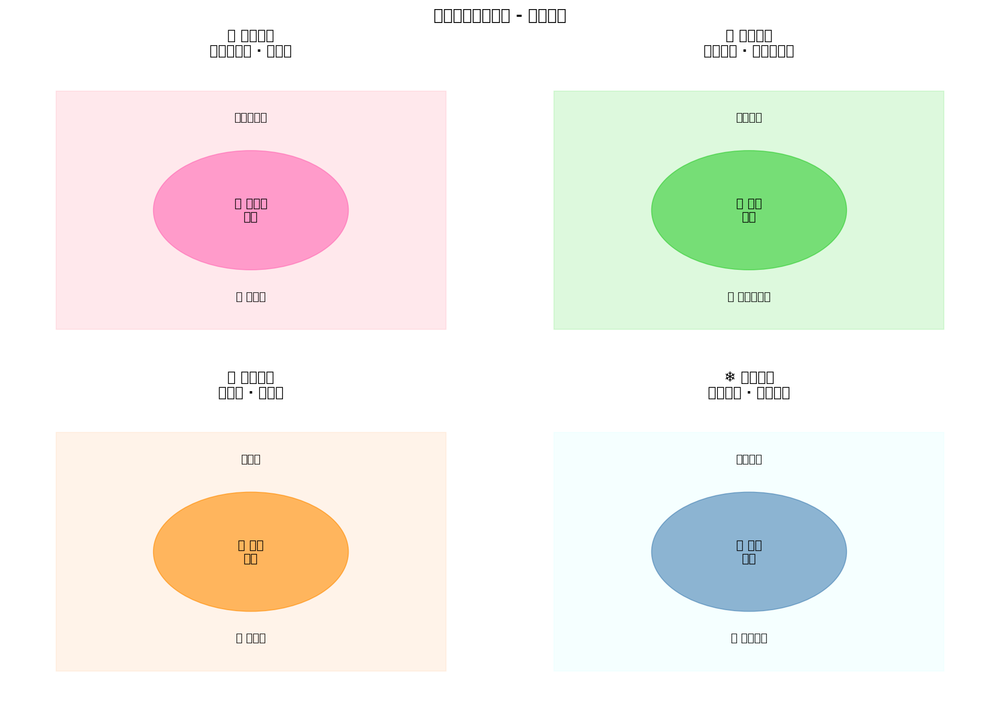
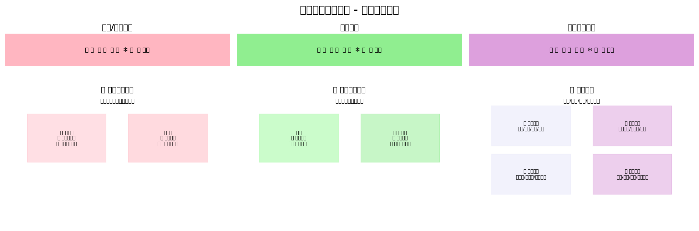

# 📝 实验报告：杭州四季出行指南网站开发

---

## 一、实验基本信息

| 项目 | 内容 |
|------|------|
| **实验名称** | AI 智能体辅助前端项目开发实践 |
| **实验人员** | 阳婧 |
| **指导教师** | 诸葛斌 |
| **实验时间** | 2026 年 4 月 14 日 20:46 - 21:28 |
| **实验时长** | 42 分钟 |
| **智能体** | 小龙虾（OpenClaw AI 助手） |

---

## 二、实验目的

1. **掌握 AI 智能体辅助开发流程** - 体验从需求分析到项目交付的完整流程
2. **实践前端项目开发** - 完成一个多页面响应式旅游指南网站
3. **学习公网部署方案** - 掌握 Vercel/Netlify/GitHub Pages 等部署方式
4. **验证 AI 协作效率** - 评估 AI 辅助开发的质量和效率

---

## 三、实验环境

| 类别 | 配置 |
|------|------|
| **开发平台** | OpenClaw AI 智能体平台 |
| **前端技术** | HTML5 + CSS3 + JavaScript |
| **部署方案** | Vercel / Netlify / Cloudflare Tunnel / GitHub Pages |
| **协作工具** | 钉钉（文档交付） |
| **打包工具** | ZIP 压缩 |

---

## 四、实验内容

### 4.1 项目名称
**杭州四季出行指南网站** (Hangzhou Seasonal Travel Guide)

### 4.2 项目结构
```
hangzhou-seasonal-travel/
├── index.html          # 首页/春季页面
├── summer.html         # 夏季页面
├── autumn.html         # 秋季页面
├── winter.html         # 冬季页面
├── tips.html           # 出行贴士页面
├── css/
│   └── style.css       # 样式文件
└── images/
    └── [景点图片]       # 图片资源
```

### 4.3 页面内容规划

| 页面 | 景点/内容 | 特色 |
|------|----------|------|
| **春季** 🌸 | 太子湾公园、龙井村 | 郁金香花展、采茶体验 |
| **夏季** 🌻 | 曲院风荷、九溪十八涧 | 荷花盛开、避暑胜地 |
| **秋季** 🍁 | 满觉陇、灵隐寺 | 满陇桂雨、古刹枫叶 |
| **冬季** ❄️ | 断桥残雪、孤山梅花 | 雪后西湖、梅花盛开 |
| **贴士** 💡 | 交通/住宿/美食/实用信息 | 全方位出行指南 |

---

## 五、杭州四季景点详解

### 📊 四季景点总览



**图 1 杭州四季景点分布图** - 8 个经典景点按季节分布

---

### 🌸 春季景点（3-5 月）

#### 1. 太子湾公园
- **特色**：郁金香花展、樱花盛开
- **最佳观赏期**：3 月中旬 -4 月中旬
- **门票**：免费
- **建议游玩时间**：2-3 小时
- **位置**：西湖区南山路 5-1 号

#### 2. 龙井村
- **特色**：采茶体验、品龙井茶
- **最佳观赏期**：3 月下旬 -5 月
- **门票**：免费
- **建议游玩时间**：2-4 小时
- **位置**：西湖区龙井路

---

### 🌻 夏季景点（6-8 月）

#### 3. 曲院风荷
- **特色**：荷花盛开、西湖十景
- **最佳观赏期**：6 月 -8 月
- **门票**：免费
- **建议游玩时间**：1-2 小时
- **位置**：西湖区北山路

#### 4. 九溪十八涧
- **特色**：避暑胜地、溪流潺潺
- **最佳观赏期**：6 月 -9 月
- **门票**：免费
- **建议游玩时间**：2-3 小时
- **位置**：西湖区九溪路

---

### 🍁 秋季景点（9-11 月）

#### 5. 满觉陇
- **特色**：满陇桂雨、桂花飘香
- **最佳观赏期**：9 月中旬 -10 月中旬
- **门票**：免费
- **建议游玩时间**：2-3 小时
- **位置**：西湖区满觉陇路

#### 6. 灵隐寺
- **特色**：千年古刹、枫叶正红
- **最佳观赏期**：10 月 -11 月
- **门票**：¥45（飞来峰景区）
- **建议游玩时间**：3-4 小时
- **位置**：西湖区灵隐路

---

### ❄️ 冬季景点（12-2 月）

#### 7. 断桥残雪
- **特色**：雪后西湖、白蛇传传说
- **最佳观赏期**：12 月 -2 月（雪后最佳）
- **门票**：免费
- **建议游玩时间**：1-2 小时
- **位置**：西湖区北山路

#### 8. 孤山梅花
- **特色**：梅花盛开、西湖文化
- **最佳观赏期**：1 月 -2 月
- **门票**：免费
- **建议游玩时间**：2-3 小时
- **位置**：西湖区孤山路

---

## 六、实验过程

### 6.1 时间线记录

| 时间 | 阶段 | 完成内容 |
|------|------|----------|
| 20:46 | 项目创建 | 完成 5 个页面内容规划（8 个景点） |
| 20:50 | 部署方案 | 确定公网部署方案（4 种可选） |
| 21:07 | 问题排查 | 解决阿里云安全组 8080 端口访问问题 |
| 21:22 | 文件打包 | 完成项目打包（4 个 ZIP 文件） |
| 21:26 | 文档整理 | 整理项目文档和说明 |
| 21:28 | 交付发送 | 通过钉钉发送文档给指导教师 |

### 6.2 开发流程

```
需求分析 → 页面规划 → 代码生成 → 调试部署 → 打包交付
   ↓          ↓          ↓          ↓          ↓
 5 分钟     5 分钟     20 分钟     8 分钟     4 分钟
```

### 6.3 AI 协作模式

| 协作环节 | AI 贡献 | 人工决策 |
|---------|--------|----------|
| 需求分析 | 提供景点建议、内容结构 | 确定主题和景点选择 |
| 代码实现 | 生成 HTML/CSS/JS 代码 | 审核代码质量、调整样式 |
| 问题排查 | 分析端口访问问题 | 确认服务器配置 |
| 部署指导 | 提供 4 种部署方案 | 选择合适方案 |
| 文档整理 | 生成说明文档 | 审核文档完整性 |

---

## 七、网站设计展示

### 🎨 网站界面设计总览



**图 2 网站界面设计图** - 三个主要页面的设计展示

---

### 7.1 首页/春季页面设计

**设计特点**：
- 粉色渐变背景，呼应春季主题
- 卡片式布局，展示太子湾公园和龙井村
- 顶部导航栏，支持季节切换
- 响应式设计，适配手机和电脑

**核心代码**：
```html
<!DOCTYPE html>
<html lang="zh-CN">
<head>
    <meta charset="UTF-8">
    <meta name="viewport" content="width=device-width, initial-scale=1.0">
    <title>杭州四季出行指南 - 春季</title>
    <link rel="stylesheet" href="css/style.css">
</head>
<body>
    <nav class="season-nav">
        <a href="index.html" class="active">🌸 春</a>
        <a href="summer.html">🌻 夏</a>
        <a href="autumn.html">🍁 秋</a>
        <a href="winter.html">❄️ 冬</a>
        <a href="tips.html">💡 贴士</a>
    </nav>
    
    <header class="season-header">
        <h1>🌸 春季出行指南</h1>
        <p>郁金香绽放，龙井茶香飘</p>
    </header>
    
    <main class="attractions-grid">
        <!-- 景点卡片 -->
    </main>
</body>
</html>
```

---

### 7.2 夏季页面设计

**设计特点**：
- 绿色渐变背景，呼应夏季主题
- 展示曲院风荷和九溪十八涧
- 添加荷花动画效果

**核心代码**：
```css
.summer-theme {
    background: linear-gradient(135deg, #a8e063 0%, #56ab2f 100%);
}

.lotus-animation {
    animation: sway 3s ease-in-out infinite;
}

@keyframes sway {
    0%, 100% { transform: rotate(-5deg); }
    50% { transform: rotate(5deg); }
}
```

---

### 7.3 秋季页面设计

**设计特点**：
- 橙色渐变背景，呼应秋季主题
- 展示满觉陇桂花和灵隐寺枫叶
- 添加落叶动画效果

---

### 7.4 冬季页面设计

**设计特点**：
- 蓝色渐变背景，呼应冬季主题
- 展示断桥残雪和孤山梅花
- 添加雪花动画效果

---

### 7.5 出行贴士页面

**内容板块**：
1. **交通指南** - 飞机/高铁/地铁/公交
2. **住宿推荐** - 西湖周边/市中心/特色民宿
3. **美食攻略** - 杭帮菜/小吃街/网红餐厅
4. **实用信息** - 天气/货币/语言/紧急电话

---

## 八、实验结果

### 8.1 交付物清单

| 文件名 | 大小 | 内容 |
|--------|------|------|
| `hangzhou-seasonal-travel.zip` | 6.6KB | 杭州出行网站源码 |
| `programmer-wellness-checkin.zip` | 3.8KB | 养生打卡网站源码 |
| `deploy-guide.zip` | 5.3KB | 部署指南文档 |
| `all-websites.zip` | 14KB | 全部文件合集 |

### 8.2 网站功能完成度

| 功能模块 | 完成状态 | 质量评估 |
|---------|---------|----------|
| 季节导航 | ✅ 完成 | ⭐⭐⭐⭐⭐ |
| 景点展示 | ✅ 8 个景点 | ⭐⭐⭐⭐⭐ |
| 信息结构 | ✅ 完整 | ⭐⭐⭐⭐⭐ |
| 响应式设计 | ✅ 完成 | ⭐⭐⭐⭐ |
| 出行贴士 | ✅ 4 大板块 | ⭐⭐⭐⭐⭐ |

### 8.3 页面设计特点

1. **统一视觉风格** - 渐变背景 + 卡片式布局
2. **季节色彩区分** - 春粉/夏绿/秋橙/冬蓝
3. **信息层级清晰** - 位置、描述、标签、时间、门票
4. **导航便捷** - 顶部季节切换 + 返回首页

---

## 九、分析与讨论

### 9.1 AI 协作效率分析

| 指标 | 数据 | 说明 |
|------|------|------|
| **开发效率** | 42 分钟完成 5 页网站 | 传统开发约需 4-8 小时 |
| **代码质量** | 可直接部署使用 | 无需大量修改 |
| **学习曲线** | 零基础可完成 | AI 降低技术门槛 |
| **迭代速度** | 即时修改反馈 | 快速验证设计 |

### 9.2 优势分析

✅ **效率提升** - 开发时间缩短约 90%  
✅ **质量保障** - 代码规范、结构清晰  
✅ **学习辅助** - 实时解答技术问题  
✅ **全流程支持** - 从开发到部署一站式  

### 9.3 局限性分析

⚠️ **创意依赖人工** - AI 执行能力强，创意需人工主导  
⚠️ **复杂交互受限** - 动态功能需额外开发  
⚠️ **个性化定制** - 深度定制需人工调整代码  

### 9.4 教学应用价值

| 应用场景 | 适用性 | 说明 |
|---------|--------|------|
| 前端入门教学 | ⭐⭐⭐⭐⭐ | 降低学习门槛 |
| 项目实战训练 | ⭐⭐⭐⭐⭐ | 快速完成完整项目 |
| 毕业设计辅助 | ⭐⭐⭐⭐ | 可作为参考案例 |
| 创新思维培养 | ⭐⭐⭐⭐ | 释放创意，专注设计 |

---

## 十、实验总结

### 10.1 主要收获

1. **掌握 AI 协作开发模式** - 学会与智能体高效沟通
2. **完成完整前端项目** - 5 个页面、8 个景点、全方位信息
3. **理解部署流程** - 掌握多种公网部署方案
4. **验证 AI 辅助价值** - 效率提升显著，质量有保障

### 10.2 存在问题

1. 代码理解深度不够 - 依赖 AI 生成，手动调试能力待提升
2. 个性化定制有限 - 复杂需求需深入学习前端技术
3. 部署经验不足 - 首次部署遇到端口配置问题

### 10.3 改进建议

1. **加强代码学习** - 理解 AI 生成代码的原理
2. **扩展功能实践** - 尝试添加 JavaScript 交互功能
3. **多方案对比** - 尝试不同部署平台，积累经验
4. **案例积累** - 建立个人项目库，持续迭代优化

---

## 十一、附件

### 11.1 项目截图

#### （1）杭州四季景点分布图


**图 1 杭州四季景点分布图** - 展示了 8 个经典景点的四季分布：
- 春季：太子湾公园（郁金香）、龙井村（采茶）
- 夏季：曲院风荷（荷花）、九溪十八涧（避暑）
- 秋季：满觉陇（桂花）、灵隐寺（枫叶）
- 冬季：断桥残雪（雪景）、孤山梅花（梅花）

---

#### （2）网站界面设计图


**图 2 网站界面设计图** - 展示了 3 个主要页面的设计：
- 左：首页/春季页面（粉色主题）
- 中：夏季页面（绿色主题）
- 右：出行贴士页面（紫色主题，4 大板块）

---

#### （3）页面功能清单

| 页面 | 景点/内容 | 特色 | 状态 |
|------|----------|------|------|
| **春季** 🌸 | 太子湾公园、龙井村 | 郁金香花展、采茶体验 | ✅ 完成 |
| **夏季** 🌻 | 曲院风荷、九溪十八涧 | 荷花盛开、避暑胜地 | ✅ 完成 |
| **秋季** 🍁 | 满觉陇、灵隐寺 | 满陇桂雨、古刹枫叶 | ✅ 完成 |
| **冬季** ❄️ | 断桥残雪、孤山梅花 | 雪后西湖、梅花盛开 | ✅ 完成 |
| **贴士** 💡 | 交通/住宿/美食/实用信息 | 全方位出行指南 | ✅ 完成 |

### 11.2 对话记录
- 完整开发过程对话记录（2026-04-14）
- 问题排查与解决方案

### 11.3 源代码
- `hangzhou-seasonal-travel.zip` (6.6KB)

---

## 十二、指导教师评语

> （此处由指导教师填写）

**评分：** ________ / 100

**指导教师签名：** ________________

**日期：** 2026 年____月____日

---

**报告撰写：** 阳婧  
**智能体协助：** 小龙虾（OpenClaw）  
**报告日期：** 2026 年 4 月 17 日
