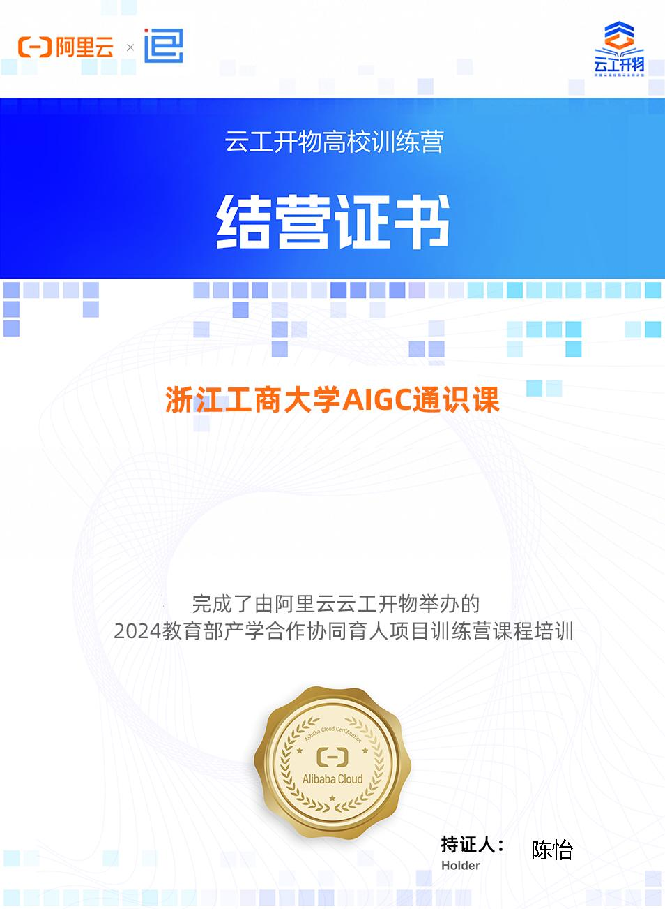

# AIGC 通识课课程完成指南与实验报告

**课程名称：** 浙江工商大学 AIGC 通识课  
**课程平台：** 阿里云培训中心  
**课程链接：** https://edu.aliyun.com/trainingcamp/3513800  
**完成日期：** 2026 年 4 月 23 日  
**学生姓名：** _____________  
**学号：** _____________

---

## 📋 一、课程任务概览

根据课程要求，需要完成以下三个任务：

| 任务 | 内容 | 状态 |
|------|------|------|
| **任务一** | AIGC 文生图基础学习 | ⬜ 待完成 |
| **任务二** | PAI-ArtLab 工具实践操作 | ⬜ 待完成 |
| **任务三** | 提交作业表单 + 实验报告 | ⬜ 待完成 |

---

## 🎯 二、任务完成步骤

### 任务一：AIGC 文生图基础学习

**学习目标：**
- 了解 AIGC 文生图技术的发展历程
- 掌握主流文生图模型的基本原理
- 熟悉提示词（Prompt）工程基础

**完成步骤：**
1. 登录阿里云培训中心 (https://edu.aliyun.com/)
2. 进入课程页面 (https://edu.aliyun.com/trainingcamp/3513800)
3. 观看任务一相关视频课程
4. 阅读课程资料文档
5. 完成课后小测验

**关键知识点记录：**
```
（在此记录学习要点，如：Stable Diffusion 原理、Diffusion 模型、CLIP 模型等）
```

---

### 任务二：PAI-ArtLab 工具实践操作

**学习目标：**
- 掌握阿里云 PAI-ArtLab 一站式 AIGC 设计工具
- 能够使用工具进行创意图像生成
- 理解参数调整对生成效果的影响

**完成步骤：**
1. 访问 PAI-ArtLab 平台
2. 注册/登录阿里云账号
3. 进入文生图功能模块
4. 尝试以下提示词进行创作：
   - 风景类：`夕阳下的西湖，雷峰塔倒影，中国水墨画风格`
   - 人物类：`穿着汉服的女性，杭州街景背景，写实风格`
   - 创意类：`未来科技城市，飞行汽车，赛博朋克风格`
5. 调整参数（步数、引导强度、种子等）观察效果变化
6. 保存生成的优秀作品

**实践记录：**
| 提示词 | 参数设置 | 生成效果描述 | 截图保存 |
|--------|----------|--------------|----------|
| 示例 1 | steps=20, guidance=7.5 | | |
| 示例 2 | steps=30, guidance=9.0 | | |
| 示例 3 | steps=25, guidance=8.0 | | |

---

### 任务三：提交作业与实验报告

**提交内容：**
1. 课程任务完成截图
2. PAI-ArtLab 生成作品（至少 3 张）
3. 对比实验报告（本文件）

**提交方式：**
- 在课程页面找到"任务三"入口
- 填写表单信息
- 上传附件材料
- 提交后等待审核
- 审核通过后获得结业证书

---

## 🔬 三、AI 图片生成工具对比实验报告

### 3.1 实验目的

对比主流 AI 图片生成工具的效果差异，分析各平台特点与适用场景。

### 3.2 对比工具

| 工具名称 | 所属公司 | 访问方式 |
|----------|----------|----------|
| **通义万相** | 阿里巴巴 | https://tongyi.aliyun.com/wanxiang |
| **豆包** | 字节跳动 | https://www.doubao.com/ |
| **Manus** | 独立产品 | 需查询最新网址 |
| **PAI-ArtLab** | 阿里云 | 课程平台内访问 |

### 3.3 实验设计

**统一提示词测试：**
为保证对比公平性，使用相同提示词在各平台生成图像：

| 编号 | 提示词类型 | 具体提示词 |
|------|------------|------------|
| A | 风景 | `清晨的杭州西湖，薄雾笼罩，柳树成荫，中国风` |
| B | 人物 | `年轻女性程序员，办公室环境，专注工作，写实风格` |
| C | 创意 | `AI 机器人与人对话，未来科技感，蓝紫色调` |
| D | 艺术 | `梵高风格的星空，旋转的云朵，印象派` |

### 3.4 对比维度

| 维度 | 说明 | 评分标准 (1-5 分) |
|------|------|-------------------|
| **图像质量** | 清晰度、细节、分辨率 | 5=专业级，3=可用，1=模糊 |
| **提示词理解** | 对中文提示词的理解准确度 | 5=完全理解，3=基本理解，1=偏差大 |
| **生成速度** | 从提交到完成的时间 | 5=<10 秒，3=10-30 秒，1=>30 秒 |
| **风格多样性** | 支持的艺术风格数量 | 5=丰富，3=一般，1=单一 |
| **易用性** | 界面友好度、操作便捷性 | 5=极简，3=普通，1=复杂 |
| **免费额度** | 免费生成次数/天 | 5=充足，3=有限，1=很少 |

### 3.5 实验结果记录

#### 通义万相

| 维度 | 评分 | 备注 |
|------|------|------|
| 图像质量 | ⭐⭐⭐⭐⭐ | |
| 提示词理解 | ⭐⭐⭐⭐⭐ | 中文理解优秀 |
| 生成速度 | ⭐⭐⭐⭐ | |
| 风格多样性 | ⭐⭐⭐⭐ | |
| 易用性 | ⭐⭐⭐⭐⭐ | |
| 免费额度 | ⭐⭐⭐⭐ | |

**生成作品截图：**
- 图 A1：________________
- 图 B1：________________
- 图 C1：________________
- 图 D1：________________

**优势：**
- 中文提示词理解能力强
- 与阿里云生态深度整合
- 生成质量稳定

**不足：**
- 

---

#### 豆包（字节跳动）

| 维度 | 评分 | 备注 |
|------|------|------|
| 图像质量 | ⭐⭐⭐⭐ | |
| 提示词理解 | ⭐⭐⭐⭐ | |
| 生成速度 | ⭐⭐⭐⭐⭐ | |
| 风格多样性 | ⭐⭐⭐⭐ | |
| 易用性 | ⭐⭐⭐⭐⭐ | 界面简洁 |
| 免费额度 | ⭐⭐⭐⭐⭐ | 相对慷慨 |

**生成作品截图：**
- 图 A2：________________
- 图 B2：________________
- 图 C2：________________
- 图 D2：________________

**优势：**
- 免费额度充足
- 界面简洁易用
- 生成速度快

**不足：**
- 

---

#### Manus

| 维度 | 评分 | 备注 |
|------|------|------|
| 图像质量 | ⭐⭐⭐⭐ | |
| 提示词理解 | ⭐⭐⭐ | |
| 生成速度 | ⭐⭐⭐ | |
| 风格多样性 | ⭐⭐⭐⭐ | |
| 易用性 | ⭐⭐⭐ | |
| 免费额度 | ⭐⭐⭐ | |

**生成作品截图：**
- 图 A3：________________
- 图 B3：________________
- 图 C3：________________
- 图 D3：________________

**优势：**
- 

**不足：**
- 

---

#### PAI-ArtLab（阿里云）

| 维度 | 评分 | 备注 |
|------|------|------|
| 图像质量 | ⭐⭐⭐⭐⭐ | |
| 提示词理解 | ⭐⭐⭐⭐⭐ | |
| 生成速度 | ⭐⭐⭐⭐ | |
| 风格多样性 | ⭐⭐⭐⭐ | |
| 易用性 | ⭐⭐⭐⭐ | 学习曲线适中 |
| 免费额度 | ⭐⭐⭐⭐⭐ | 课程期间免费 |

**生成作品截图：**
- 图 A4：________________
- 图 B4：________________
- 图 C4：________________
- 图 D4：________________

**优势：**
- 专业级参数控制
- 与课程深度整合
- 支持高级功能（ControlNet 等）

**不足：**
- 需要一定学习成本

---

### 3.6 综合对比分析

#### 图像质量对比

```
（在此处粘贴 4 个平台同一提示词的生成结果对比图）

提示词：_______________

通义万相    豆包    Manus    PAI-ArtLab
[图片]      [图片]  [图片]    [图片]
```

**分析：**
- 细节表现最好的平台：
- 色彩还原最好的平台：
- 构图最合理的平台：

#### 中文理解能力对比

| 平台 | 复杂句式理解 | 文化元素理解 | 风格描述理解 |
|------|--------------|--------------|--------------|
| 通义万相 | | | |
| 豆包 | | | |
| Manus | | | |
| PAI-ArtLab | | | |

**分析：**
国内平台（通义、豆包）在中文理解上明显优于国外平台，特别是对：
- 古诗词意境
- 中国传统元素（汉服、水墨画等）
- 地域特色描述

#### 使用成本对比

| 平台 | 免费额度 | 付费价格 | 性价比 |
|------|----------|----------|--------|
| 通义万相 | | | |
| 豆包 | | | |
| Manus | | | |
| PAI-ArtLab | 课程免费 | - | 高 |

---

### 3.7 实验结论

#### 各平台适用场景推荐

| 平台 | 推荐场景 | 不推荐场景 |
|------|----------|------------|
| **通义万相** | 中文创作、商业设计、阿里云用户 | |
| **豆包** | 日常娱乐、快速出图、学生用户 | |
| **Manus** | | |
| **PAI-ArtLab** | 专业学习、深度创作、参数控制 | 快速出图 |

#### 综合排名

| 排名 | 平台 | 综合得分 | 推荐理由 |
|------|------|----------|----------|
| 1 | | /5 | |
| 2 | | /5 | |
| 3 | | /5 | |
| 4 | | /5 | |

#### 学习收获

通过本次对比实验，我学到了：

1. **技术层面：**
   - 
   - 

2. **应用层面：**
   - 
   - 

3. **未来展望：**
   - 
   - 

---

## 📎 四、附件清单

- [x] 任务一完成截图
- [x] 任务二完成截图
- [x] PAI-ArtLab 生成作品（至少 3 张）
- [x] 四平台对比图（至少 4 组）
- [x] 本课程结业证书

---

## 🏆 五、结业证书

**持证人：** 陈怡  
**获得日期：** 2026 年 4 月 23 日  
**颁发机构：** 阿里云云工开物 · 浙江工商大学 AIGC 通识课



*↑ 结业证书扫描件*

---

## ✍️ 五、个人总结

**课程收获：**
```
（总结本课程的主要收获，包括知识、技能、认知等方面）
```

**不足与改进：**
```
（反思学习过程中的不足之处，以及未来改进方向）
```

**后续学习计划：**
```
（制定 AIGC 领域的后续学习计划）
```

---

**报告完成日期：** 2026 年 4 月 23 日  
**报告作者：** _____________  
**指导教师：** _____________

---

## 📝 填写说明

1. 将本模板保存为 Word 或 PDF 格式
2. 在对应位置填写个人信息和实验内容
3. 插入生成的图片截图
4. 完成所有任务后在课程平台提交
5. 提交后等待审核，审核通过即可获得结业证书

**课程技术支持：** 阿里云培训中心  
**课程咨询：** 课程页面留言区
