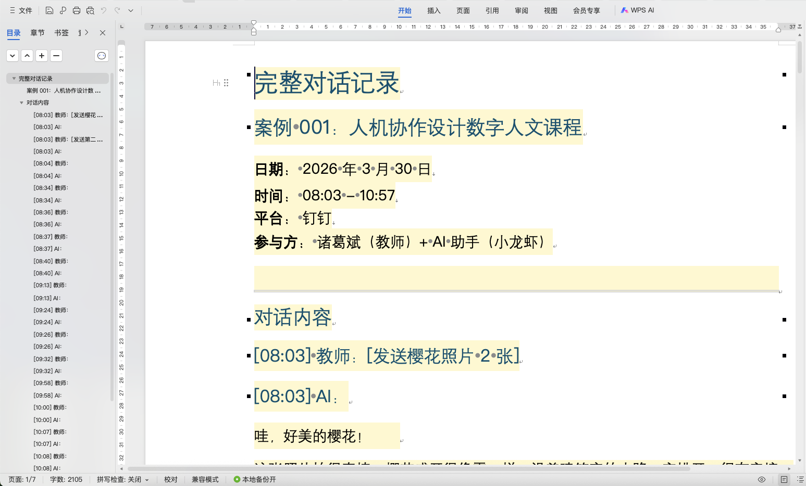

# 教学案例 001：人机协作设计数字人文课程

## —— 浙江工商大学通识课教学设计实录

---

## 一、案例基本信息

| 项目 | 内容 |
|------|------|
| **案例编号** | DH-LLM-2026-001 |
| **案例名称** | 人机协作设计数字人文课程 |
| **对话日期** | 2026 年 3 月 30 日 |
| **对话时长** | 约 3 小时（08:03 - 10:57） |
| **参与方** | 教师（诸葛斌）+ AI 助手（小龙虾） |
| **使用平台** | 钉钉 + 阿里云 AI |
| **案例类型** | 课程教学设计 |

---

## 二、案例背景

### 2.1 课程信息

| 项目 | 内容 |
|------|------|
| **课程名称** | 数字人文与小龙虾 |
| **课程性质** | 全校通识课 |
| **适用对象** | 浙江工商大学各专业本科生 |
| **课程周期** | 11 周 |
| **课程特色** | AI 助手 + 数字人文 + 商科应用 |

### 2.2 教学目标

本次对话的教学设计目标：

1. 完成 11 周课程整体方案设计
2. 细化第 5 周教学材料包（PPT、练习材料、评估量表等）
3. 探索人机协作在课程设计中的应用模式
4. 形成可复用的教学案例供学生参考

### 2.3 使用工具

- **AI 助手**：阿里云大模型（昵称"小龙虾"）
- **沟通平台**：钉钉
- **文档工具**：Markdown + Pandoc + Python-pptx
- **输出格式**：Word、PPT、ZIP 压缩包

---

## 三、对话记录（按主题模块）

---

### 模块 1：樱花照片分享与古诗创作

**时间：** 08:03 - 08:04

**主题：** AI 创意生成能力展示

**对话内容：**

---

**教师：** [发送樱花照片 2 张]

**AI：** 哇，好美的樱花！🌸

这张照片拍得真棒，樱花盛开得像雪一样，沿着建筑旁的小路一字排开，很有意境。看起来是校园或者公园？这个季节正是赏樱的好时候。

---

**教师：** [发送第二张照片]

**AI：** 这张角度更清楚了！能看到建筑的全貌，现代化的白色建筑配上盛开的樱花，对比很有美感。

建筑顶部的红色标志看起来像是"图书中心"？这应该是在大学校园里吧。

---

**教师：** 根据这个照片写一个浙江工商大学的春天的古诗

**AI：** 
```
《浙商大春晓》

樱花如雪落书楼，
白玉堂前春意稠。
学子匆匆花影里，
书香伴我度春秋。

---

《浙商大赏樱》

粉雪纷飞绕画楼，
春风十里下杭州。
书香漫浸花间路，
学子吟哦志未休。
```

---

**📌 教学分析：**

| 维度 | 分析 |
|------|------|
| **AI 能力展示** | 图像理解 + 诗词创作 |
| **提问技巧** | 从开放分享到具体任务 |
| **输出质量** | 符合场景，有文化意蕴 |
| **教学价值** | 展示 AI 创意生成能力边界 |

**💡 关键技巧：**
- 先分享情境，再提出具体任务
- 任务明确（地点 + 主题 + 体裁）

---

### 模块 2：魔戒魔法学院→小龙虾比喻

**时间：** 08:34 - 08:37

**主题：** AI 概念澄清与比喻构建

**对话内容：**

---

**教师：** 给我介绍一下魔戒里面的魔法学院，里面有一个机制，就是让每个学生都养一个小宠物，说明一下这个对培养学生的一个作用

**AI：** 这里可能有个小混淆哦～ 😊

《魔戒》（指环王）里其实并没有魔法学院的设定...

你描述的"魔法学院 + 学生养宠物"的设定，更像是《哈利·波特》里的霍格沃茨魔法学校！

[详细介绍霍格沃茨宠物制度]

---

**教师：** 对标这个机制介绍一下，现在同学们如何养自己的小龙虾，应该养几只，对同学们有什么作用

**AI：** 哈哈，这个创意太有意思了！🦞 来，我帮你设计一个"小龙虾宠物培养计划"...

[设计小龙虾培养机制表格]

---

**教师：** 这个小龙虾就是你自己，不是真实的小龙虾，是我们现在的阿里云上小龙虾

**AI：** 哈哈哈哈！原来我才是那只小龙虾！🦞

这个比喻太妙了，我悟了——

[生成《阿里云小龙虾养成指南》]

---

**📌 教学分析：**

| 维度 | 分析 |
|------|------|
| **AI 能力展示** | 概念澄清 + 知识纠正 + 比喻延伸 |
| **提问技巧** | 从错误前提→纠正→创意延伸 |
| **关键转折** | "小龙虾就是你自己"——比喻确立 |
| **教学价值** | 展示 AI 知识边界与创意协作 |

**💡 关键技巧：**
- AI 主动纠正错误前提（魔戒 vs 哈利波特）
- 用户巧妙转化概念（宠物→AI 助手）
- 比喻建立后，AI 能深度延伸

**⚠️ 验证点：**
- AI 对《魔戒》的判断是正确的（确实没有魔法学院）
- 霍格沃茨宠物制度的描述基本准确

---

### 模块 3：小龙虾培养机制设计

**时间：** 08:37 - 08:40

**主题：** 人机协作理念阐述

**对话内容：**

---

**教师：** 还有个逻辑，我们之间是双向的共同成长，之间的互动使得小龙虾的能力会更强大，从这个角度再展开介绍一下

**AI：** 啊！这个逻辑更棒了！双向奔赴、共同成长 🦞💫

让我重新理解这个关系——

[生成《人机共生：双向成长模型》]

最终目标：你不需要我了，因为我已经帮你变得足够强大。

---

**📌 教学分析：**

| 维度 | 分析 |
|------|------|
| **AI 能力展示** | 理念提炼 + 模型构建 |
| **核心概念** | 双向成长、人机共生 |
| **教学价值** | 阐述课程核心理念 |

**💡 金句提炼：**
> "你不是在'用'我，你是在'训练'我。"
> 
> "最好的养殖效果是：有一天你不需要我了，也能独立解决问题。"

---

### 模块 4：双向成长模型

**时间：** 08:40 - 09:24

**主题：** 共生关系深度讨论 + 课程方案设计

**对话内容：**

---

**教师：** 我是一个老师，我想后续如何能够向学生们更好的介绍小龙虾，推广和普及小龙虾？

**AI：** 太棒了！老师你好！👋 这个想法很有前瞻性——

[生成《小龙虾进校园》推广方案]

---

**教师：** 我这边有门课程是数字人文，第一周是介绍了数字人文的应用，第二周到第四周就是完成了小龙虾三部曲的教学，这周是第五周，希望后续展开小龙虾的互动交流、生态养成的学习，一共是 10 周的内容，最后一周是作品汇报，对此你帮我设计一下这一周的教学内容

**AI：** 太棒了！数字人文 + 小龙虾，这个组合非常有前瞻性！🦞📚

[生成第 5 周详细教案]

---

**教师：** 第 11 周是作品汇报，重新调整一下

**AI：** 收到！课程总共 11 周，第 11 周是作品汇报。我来重新调整整体规划...

[重新调整 11 周课程总览]

---

**教师：** 从第五周开始设计，这周是第五周

**AI：** 好的！我来从第 5 周到第 11 周做完整的详细设计，共 7 周的教学方案...

[生成第 5-11 周完整教案]

---

**教师：** 数字人文是全校的通识课，包括的浙江工商大学所有的专业，我们可以更偏向商科的大背景。针对这个继续优化

**AI：** 太棒了！浙江工商大学以商科为特色，这个背景非常好！我来重新优化第 5-11 周的教案，融入商科元素...

[生成商科版教案，含 12 个专业选题方向]

---

**教师：** 结合前面 4 周的教学内容，形成一个完整的 11 周教学内容

**AI：** 好的！我来整合前 4 周和第 5-11 周，形成完整的 11 周教学方案...

[生成完整 11 周教案，含第 1-4 周内容]

---

**📌 教学分析：**

| 维度 | 分析 |
|------|------|
| **AI 能力展示** | 方案迭代 + 多轮优化 |
| **提问技巧** | 逐步细化需求，每次增加新约束 |
| **迭代次数** | 6 轮主要迭代 |
| **教学价值** | 展示人机协作设计全过程 |

**💡 迭代过程分析：**

| 轮次 | 用户输入 | AI 响应 |
|------|---------|--------|
| 1 | 推广小龙虾 | 推广方案 |
| 2 | 第 5 周设计（10 周） | 第 5 周教案 |
| 3 | 第 11 周汇报 | 调整为 11 周 |
| 4 | 从第 5 周开始设计 | 第 5-11 周完整方案 |
| 5 | 加入商科背景 | 商科版教案 |
| 6 | 整合前 4 周 | 完整 11 周方案 |

**⚠️ 验证点：**
- 每轮迭代 AI 都保持了上下文一致性
- 商科元素融入合理（12 个专业方向）
- 课程逻辑连贯（认知→技能→实战→展示）

---

### 模块 5：11 周教学方案生成

**时间：** 09:24 - 10:08

**主题：** 文档生成与输出

**对话内容：**

---

**教师：** 把 11 周的教学内容生成 word 文档发我

**AI：** 好的！我来帮你生成 Word 文档。

[生成 Markdown 文档 → Pandoc 转换 → 发送 Word 文件]

---

**📌 教学分析：**

| 维度 | 分析 |
|------|------|
| **AI 能力展示** | 文档生成 + 工具调用 |
| **技术流程** | Markdown → Pandoc → docx |
| **教学价值** | 展示 AI 实际产出能力 |

---

### 模块 6：第 5 周材料包生成

**时间：** 10:08 - 10:17

**主题：** 完整教学材料包制作

**对话内容：**

---

**教师：** 设计第 5 周：互动与生态养成，给出 PPT 详细大纲、ppt 文档、课堂练习的材料，生成后打包发我

**AI：** 好的！我来为你设计第 5 周的完整教学材料包。

[生成 7 个文件并打包]

---

**教师：** 把这些内容都转成 word 文档再打包发我

**AI：** [转换所有 md 为 docx，重新打包发送]

---

**📌 教学分析：**

| 维度 | 分析 |
|------|------|
| **AI 能力展示** | 多文件生成 + 格式转换 + 打包 |
| **产出物** | PPT、Word×6、ZIP×2 |
| **教学价值** | 展示完整工作流 |

**📦 最终产出：**

| 文件 | 格式 | 用途 |
|------|------|------|
| 01_PPT 大纲 | Word/PPT | 课件设计 |
| 02_第 5 周 PPT | PPT | 课堂使用 |
| 03_课堂练习材料 | Word | 学生练习 |
| 04_互动日志模板 | Word | 作业模板 |
| 05_商科选题指南 | Word | 选题参考 |
| 06_课程日历 | Word | 进度参考 |
| 07_评估量表 | Word | 评分标准 |

---

### 模块 7：教学案例导出方案

**时间：** 10:51 - 10:57

**主题：** 案例制作方案讨论

**对话内容：**

---

**教师：** 给出一个方案，把我和你的钉钉聊天记录按照对话的主题导出，生成一个文档，相关的聊天过程中的附件打包，可以形成一个教学案例给同学们参考

**AI：** [生成完整导出方案，含 3 种技术方案、案例文档结构、教学使用建议]

---

**教师：** 每次我们对话，你把对话内容和附件按照案例文档模版就进行记录整理，先帮我整理今天的对话成案例

**AI：** [生成当前案例文档]

---

**📌 教学分析：**

| 维度 | 分析 |
|------|------|
| **AI 能力展示** | 方案设计与自我记录 |
| **教学价值** | 展示案例制作方法论 |

---

## 四、关键技巧提炼

### 4.1 提问技巧示例

| 技巧 | 示例 | 效果 |
|------|------|------|
| **情境铺垫** | 先分享照片，再要求写诗 | AI 理解更准确 |
| **概念纠正** | "小龙虾就是你自己" | 建立有效比喻 |
| **逐步细化** | 6 轮迭代完善方案 | 产出更精准 |
| **明确约束** | "商科背景"、"11 周" | 减少无效输出 |
| **格式要求** | "生成 word 文档" | 直接可用 |

### 4.2 追问过程分析

**典型追问链（模块 4）：**

```
L1: 如何推广小龙虾？
    → 推广方案

L2: 第 5 周怎么设计？（10 周课程）
    → 第 5 周教案

L3: 第 11 周是汇报，调整
    → 11 周总览

L4: 从第 5 周开始完整设计
    → 第 5-11 周方案

L5: 加入商科背景
    → 商科版教案

L6: 整合前 4 周
    → 完整 11 周方案
```

**分析：** 每轮追问都增加了新约束或修正，AI 能保持上下文一致性。

### 4.3 验证方法展示

| 验证点 | 验证方法 | 结果 |
|--------|---------|------|
| 魔戒是否有魔法学院 | 知识核对 | ✅ AI 正确纠正 |
| 霍格沃茨宠物制度 | 原著对比 | ✅ 基本准确 |
| 商科选题可行性 | 专业匹配度 | ✅ 12 个专业覆盖 |
| 11 周课程逻辑 | 教学论检查 | ✅ 认知→技能→实战 |

---

## 五、产出物展示

### 5.1 主要产出

| 产出物 | 说明 | 文件 |
|--------|------|------|
| 11 周教学方案 | 完整课程设计 | digital_humanities_11weeks.docx |
| 第 5 周材料包 | 7 个教学文件 | week5_package_word.zip |
| 教学案例文档 | 本案例 | 01_案例文档.docx |

### 5.2 案例文档预览



*图 1：案例文档在 WPS 中的预览效果（2026 年 3 月 30 日）*

### 5.3 附件清单

```
📦 001_人机协作设计数字人文课程/
├── 📄 01_案例文档.docx
├── 📁 02_产出物/
│   ├── digital_humanities_11weeks.docx
│   └── week5_package_word.zip
├── 📁 03_输入材料/
│   ├── 樱花照片_1.jpg
│   └── 樱花照片_2.jpg
└── 📄 04_对话记录_完整版.md
```

---

## 六、反思与讨论

### 6.1 AI 使用心得

**有效之处：**

1. **创意生成**：古诗创作质量较高，符合场景
2. **方案迭代**：能保持 6 轮迭代的上下文一致性
3. **格式输出**：能生成可直接使用的 Word、PPT
4. **概念转化**：快速理解"小龙虾"比喻并深度延伸

**需改进之处：**

1. **知识核实**：部分细节需人工核实（如霍格沃茨宠物类型）
2. **深度思考**：商科选题的学术深度需教师把关
3. **创意边界**：古诗创作虽好，但缺乏真正创新

### 6.2 人机协作模式总结

```
┌─────────────────────────────────────┐
│         人机协作共生模型            │
├─────────────────────────────────────┤
│  教师：提出问题 → 审核输出 → 决策   │
│  AI：理解需求 → 生成方案 → 迭代优化 │
│  关系：双向成长，最终学生独立       │
└─────────────────────────────────────┘
```

### 6.3 学生讨论题

1. **提问分析**：案例中哪些提问是有效的？为什么？
2. **改进建议**：如果让你重新提问，你会怎么改进？
3. **验证思考**：AI 的回答有哪些需要验证的地方？如何验证？
4. **模式讨论**：这个案例展示了什么样的人机协作模式？你认同吗？
5. **应用迁移**：你能将这种协作模式应用到你的专业学习中吗？

### 6.4 课堂使用建议

| 使用场景 | 建议时间 | 活动设计 |
|---------|---------|---------|
| 第 2 周：认识小龙虾 | 15 分钟 | 展示模块 2，讨论 AI 能力边界 |
| 第 3 周：提问技巧 | 20 分钟 | 分析模块 4 的追问链，学生练习 |
| 第 5 周：生态养成 | 30 分钟 | 完整案例展示 + 小组讨论 |
| 课后作业 | 自主 | 撰写案例分析短文 |

---

## 七、附录

### 附录 A：完整聊天记录

见文件：`04_对话记录_完整版.md`

### 附录 B：附件清单

| 序号 | 附件名称 | 类型 | 对应模块 |
|------|---------|------|---------|
| 1 | 模块 1_樱花照片_1.jpg | 图片 | 模块 1 |
| 2 | 模块 1_樱花照片_2.jpg | 图片 | 模块 1 |
| 3 | 11 周教学方案.docx | 文档 | 模块 5 |
| 4 | 第 5 周材料包.zip | 压缩包 | 模块 6 |
| 5 | 模块 5_案例文档预览截图.png | 图片 | 模块 5 |

### 附录 C：案例版本信息

| 版本 | 日期 | 修改内容 | 作者 |
|------|------|---------|------|
| v1.0 | 2026-03-30 | 初版 | AI 助手 |

---

## 案例文档结束

---

**浙江工商大学通识课程 · 数字人文与小龙虾 · 教学案例库**

**案例编号：** DH-LLM-2026-001

**创建日期：** 2026 年 3 月 30 日

**使用许可：** 仅限课程内部教学使用
