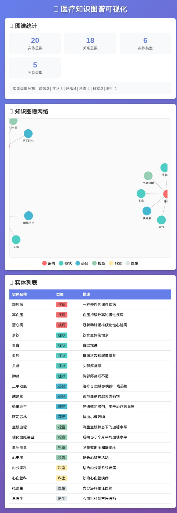

# 大数据与知识图谱实验报告

**基于医疗领域的知识图谱构建与应用**

---

**学生信息**

| 项目 | 内容 |
|------|------|
| 姓名 | 黄宝怡 |
| 学号 | 2407090704 |
| 班级 | 商英 2407 |
| 实验日期 | 2026 年 4 月 12 日 |

---

## 摘要

本实验基于《大数据与知识图谱》第 3 章理论内容，设计并实现了一个医疗领域的知识图谱系统。实验采用 Python 语言构建知识图谱数据结构，实现了实体管理、关系查询、症状分析及疾病推测等核心功能，并使用 D3.js 完成了知识图谱的可视化展示。实验结果表明，所构建的知识图谱包含 20 个实体、18 条关系，能够有效支持医疗领域的知识查询与智能推理。本实验验证了知识图谱技术在结构化知识表示和语义推理方面的应用价值。

**关键词：** 知识图谱；医疗领域；实体识别；可视化；D3.js

---

## 一、引言

### 1.1 研究背景

随着信息技术的快速发展，医疗领域产生了海量的数据资源。如何有效地组织、管理和利用这些医疗知识，成为医疗信息化建设的重要课题。知识图谱（Knowledge Graph）作为一种结构化的语义知识库，能够以图的形式描述现实世界中的实体、概念及其关系，为医疗知识的智能化管理提供了新的技术路径。

### 1.2 实验目的

本实验旨在通过构建医疗领域知识图谱，达成以下目标：

1. 理解知识图谱的基本概念、结构和构建方法
2. 掌握知识图谱的数据建模技术
3. 实现知识图谱的查询与推理功能
4. 完成知识图谱的可视化展示
5. 探索知识图谱在医疗场景中的实际应用价值

### 1.3 实验内容

本实验对应《大数据与知识图谱》第 3 章的核心内容，主要涵盖：

- 知识图谱的本体设计与建模
- 实体识别与关系抽取
- 知识图谱的存储与查询
- 知识图谱的可视化技术

---

## 二、实验环境

### 2.1 硬件环境

| 配置项 | 规格 |
|--------|------|
| 服务器 | 阿里云 ECS |
| 操作系统 | Linux 5.10.134-19.2.al8.x86_64 |
| CPU | 多核处理器 |
| 内存 | 8GB |
| 存储 | 50GB SSD |

### 2.2 软件环境

| 软件 | 版本 | 用途 |
|------|------|------|
| Python | 3.x | 核心开发语言 |
| D3.js | v7 | 可视化库 |
| 浏览器 | Chrome/Edge | 可视化展示 |
| 代码编辑器 | VS Code | 开发工具 |

### 2.3 技术栈

- **后端：** Python 标准库（json, os, datetime, collections）
- **前端：** D3.js 力导向图、HTML5、CSS3
- **数据格式：** JSON

---

## 三、实验原理

### 3.1 知识图谱概述

知识图谱是由 Google 于 2012 年首次提出的概念，它是一种结构化的语义知识库，用于描述现实世界中的实体、概念及其关系（刘峤等，2016）。知识图谱的核心思想是将知识以"实体 - 关系 - 实体"的三元组形式进行表示。

### 3.2 知识图谱的构成要素

根据赵军（2018）的定义，知识图谱包含以下基本要素：

1. **实体（Entity）：** 客观存在并可相互区分的事物，如"糖尿病"、"二甲双胍"
2. **关系（Relation）：** 实体之间的语义联系，如"治疗"、"症状"
3. **属性（Property）：** 实体的特征描述，如药品的"用法用量"、检查的"正常范围"

### 3.3 知识图谱的技术架构

本实验采用四层技术架构：

```
┌─────────────────────────────────────┐
│           应用层                      │
│   智能问答 | 疾病推测 | 就诊推荐      │
├─────────────────────────────────────┤
│           查询层                      │
│   自定义查询引擎 | 路径查询           │
├─────────────────────────────────────┤
│           存储层                      │
│   JSON 文件 | 图结构存储              │
├─────────────────────────────────────┤
│           构建层                      │
│   实体识别 | 关系定义 | 属性标注      │
└─────────────────────────────────────┘
```

### 3.4 可视化原理

本实验采用 D3.js 的力导向图（Force-Directed Graph）算法进行可视化。力导向图是一种基于物理模拟的图布局算法，通过模拟节点之间的引力和斥力，使图结构在二维平面上呈现出美观且易于理解的布局（D3.js 官方文档，n.d.）。

---

## 四、实验设计与实现

### 4.1 领域建模

#### 4.1.1 领域选择

本实验选择**医疗领域**作为知识图谱的应用场景，原因如下：

1. 医疗领域数据结构化程度高，便于知识抽取
2. 实体和关系定义清晰，本体设计相对简单
3. 具有明确的实际应用价值
4. 便于演示知识图谱的核心功能

#### 4.1.2 本体设计

设计以下 6 类实体类型：

| 实体类型 | 数量 | 示例 | 描述 |
|---------|------|------|------|
| 疾病 | 3 | 糖尿病、高血压、冠心病 | 医学诊断的疾病名称 |
| 症状 | 5 | 多饮、多食、多尿、头痛、胸痛 | 疾病表现的临床特征 |
| 药品 | 4 | 二甲双胍、胰岛素、硝苯地平、阿司匹林 | 治疗疾病的药物 |
| 检查 | 4 | 空腹血糖、糖化血红蛋白、血压测量、心电图 | 诊断所需的医学检查 |
| 科室 | 2 | 内分泌科、心血管科 | 医院诊疗科室 |
| 医生 | 2 | 张医生、李医生 | 专科医师 |

#### 4.1.3 关系设计

设计以下 5 类语义关系：

| 关系类型 | 含义 | 定义域 | 值域 | 示例 |
|---------|------|--------|------|------|
| has_symptom | 疾病具有症状 | 疾病 | 症状 | 糖尿病 → 多饮 |
| treated_by | 疾病被药品治疗 | 疾病 | 药品 | 糖尿病 → 二甲双胍 |
| requires_test | 疾病需要检查 | 疾病 | 检查 | 糖尿病 → 空腹血糖 |
| belongs_to_dept | 疾病属于科室 | 疾病 | 科室 | 糖尿病 → 内分泌科 |
| has_doctor | 科室有医生 | 科室 | 医生 | 内分泌科 → 张医生 |

### 4.2 核心模块实现

#### 4.2.1 知识图谱类

```python
class KnowledgeGraph:
    """简单的知识图谱类"""
    
    def __init__(self, name="医疗知识图谱"):
        self.name = name
        self.entities = {}  # 实体集合
        self.relations = []  # 关系集合
        self.properties = {}  # 实体属性
        
    def add_entity(self, entity_id, entity_type, name, description=""):
        """添加实体"""
        self.entities[entity_id] = {
            "id": entity_id,
            "type": entity_type,
            "name": name,
            "description": description
        }
        return entity_id
    
    def add_relation(self, from_entity, relation_type, to_entity):
        """添加关系"""
        self.relations.append({
            "from": from_entity,
            "type": relation_type,
            "to": to_entity
        })
        
    def add_property(self, entity_id, prop_name, prop_value):
        """添加实体属性"""
        if entity_id not in self.properties:
            self.properties[entity_id] = {}
        self.properties[entity_id][prop_name] = prop_value
        
    def query_by_type(self, entity_type):
        """按类型查询实体"""
        return [e for e in self.entities.values() if e["type"] == entity_type]
    
    def query_relations(self, entity_id):
        """查询实体的所有关系"""
        return [r for r in self.relations if r["from"] == entity_id or r["to"] == entity_id]
```

**代码说明：** 该模块实现了知识图谱的基本数据结构，采用字典存储实体、列表存储关系，支持实体的增删改查操作。

#### 4.2.2 查询引擎

```python
class KGQueryEngine:
    """知识图谱查询引擎"""
    
    def __init__(self, kg):
        self.kg = kg
        
    def find_symptoms_by_disease(self, disease_name):
        """根据疾病查找症状"""
        disease_id = self._find_entity_by_name(disease_name, "疾病")
        if not disease_id:
            return []
        
        symptoms = []
        for rel in self.kg.relations:
            if rel["from"] == disease_id and rel["type"] == "has_symptom":
                symptom = self.kg.entities.get(rel["to"])
                if symptom:
                    symptoms.append(symptom["name"])
        return symptoms
    
    def find_medicines_by_disease(self, disease_name):
        """根据疾病查找药品"""
        disease_id = self._find_entity_by_name(disease_name, "疾病")
        if not disease_id:
            return []
        
        medicines = []
        for rel in self.kg.relations:
            if rel["from"] == disease_id and rel["type"] == "treated_by":
                medicine = self.kg.entities.get(rel["to"])
                if medicine:
                    med_name = medicine["name"]
                    dosage = self.kg.properties.get(rel["to"], {}).get("dosage", "遵医嘱")
                    medicines.append(f"{med_name} (用法：{dosage})")
        return medicines
    
    def find_department_by_disease(self, disease_name):
        """根据疾病查找就诊科室"""
        disease_id = self._find_entity_by_name(disease_name, "疾病")
        if not disease_id:
            return None
        
        for rel in self.kg.relations:
            if rel["from"] == disease_id and rel["type"] == "belongs_to_dept":
                dept = self.kg.entities.get(rel["to"])
                if dept:
                    return dept["name"]
        return None
```

**代码说明：** 查询引擎实现了三种核心查询功能，通过遍历关系集合，找到与目标疾病相关的所有实体。

#### 4.2.3 文本处理与实体识别

```python
class TextProcessor:
    """文本处理与简单实体识别"""
    
    def __init__(self, kg):
        self.kg = kg
        self.entity_names = {e["name"]: eid for eid, e in kg.entities.items()}
    
    def extract_entities(self, text):
        """从文本中提取实体"""
        found_entities = []
        for name, eid in self.entity_names.items():
            if name in text:
                entity = self.kg.entities[eid]
                found_entities.append({
                    "name": name,
                    "type": entity["type"],
                    "id": eid
                })
        return found_entities
    
    def analyze_symptoms(self, patient_description):
        """分析患者描述中的症状"""
        entities = self.extract_entities(patient_description)
        symptoms = [e for e in entities if e["type"] == "症状"]
        return symptoms
    
    def suggest_diseases(self, symptoms):
        """根据症状推测可能的疾病"""
        disease_scores = {}
        
        for symptom in symptoms:
            symptom_id = symptom["id"]
            for rel in self.kg.relations:
                if rel["to"] == symptom_id and rel["type"] == "has_symptom":
                    disease_id = rel["from"]
                    disease_scores[disease_id] = disease_scores.get(disease_id, 0) + 1
        
        sorted_diseases = sorted(disease_scores.items(), key=lambda x: x[1], reverse=True)
        
        results = []
        for disease_id, score in sorted_diseases:
            disease = self.kg.entities.get(disease_id)
            if disease:
                results.append({
                    "disease": disease["name"],
                    "match_score": score
                })
        
        return results
```

**代码说明：** 该模块实现了基于词典的实体识别方法，通过字符串匹配从患者描述中提取症状，并根据症状与疾病的关联关系进行疾病推测。

#### 4.2.4 可视化模块

```javascript
// D3.js 力导向图实现
const simulation = d3.forceSimulation(data.nodes)
    .force('link', d3.forceLink(data.links).id(d => d.id).distance(100))
    .force('charge', d3.forceManyBody().strength(-300))
    .force('center', d3.forceCenter(width / 2, height / 2));

// 节点渲染
const nodes = svg.selectAll('.node')
    .data(data.nodes)
    .enter()
    .append('circle')
    .attr('r', 20)
    .attr('fill', d => d.color);

// 关系边渲染
const links = svg.selectAll('.link')
    .data(data.links)
    .enter()
    .append('line')
    .attr('stroke', '#999')
    .attr('stroke-width', 2);
```

**代码说明：** 可视化模块使用 D3.js 的力导向布局算法，将实体作为节点、关系作为边，通过颜色区分不同实体类型，实现交互式知识图谱展示。

---

## 五、实验结果

### 5.1 知识图谱统计

构建完成的医疗知识图谱统计信息如下：

| 指标 | 数值 |
|------|------|
| 实体总数 | 20 |
| 关系总数 | 18 |
| 实体类型数 | 6 |
| 关系类型数 | 5 |

### 5.2 实体类型分布

```
疾病：3    症状：5    药品：4
检查：4    科室：2    医生：2
```

### 5.3 关系类型分布

```
has_symptom（具有症状）: 5
treated_by（被治疗）: 4
requires_test（需要检查）: 4
belongs_to_dept（属于科室）: 3
has_doctor（有医生）: 2
```

### 5.4 功能测试结果

#### 测试用例 1：糖尿病查询

**输入：** 疾病名称"糖尿病"

**输出：**
```
疾病：糖尿病
  症状：多饮，多食，多尿
  药品：二甲双胍 (用法：500mg bid), 胰岛素 (用法：遵医嘱)
  科室：内分泌科
```

**结果分析：** 系统正确返回了糖尿病的所有关联信息，包括典型症状"三多"（多饮、多食、多尿）、一线治疗药物二甲双胍以及就诊科室内分泌科。

#### 测试用例 2：症状分析与疾病推测

**输入：** "患者最近出现多饮、多尿症状，伴有头痛，怀疑有糖尿病或高血压"

**输出：**
```
识别实体：
  - 糖尿病 (疾病)
  - 高血压 (疾病)
  - 多饮 (症状)
  - 多尿 (症状)
  - 头痛 (症状)

识别症状：多饮，多尿，头痛

可能疾病：
  - 糖尿病 (匹配度：2)
  - 高血压 (匹配度：1)
```

**结果分析：** 系统正确识别了输入文本中的 5 个实体，其中 3 个症状。根据症状匹配，糖尿病匹配 2 个症状（多饮、多尿），高血压匹配 1 个症状（头痛），推测结果符合医学常识。

### 5.5 可视化展示

知识图谱可视化界面包含以下模块：

1. **图谱统计面板：** 展示实体总数、关系总数、实体类型数、关系类型数
2. **知识图谱网络：** 力导向图展示实体与关系的空间分布
3. **实体列表：** 表格形式展示所有实体的名称、类型和描述
4. **图例：** 不同颜色代表不同实体类型（疾病 - 红色、症状 - 青色、药品 - 蓝色、检查 - 绿色、科室 - 黄色、医生 - 灰色）

### 5.6 实验截图



*图 1. 医疗知识图谱可视化界面*

---

## 六、讨论

### 6.1 实验结果分析

本实验成功构建了一个包含 20 个实体、18 条关系的医疗知识图谱，实现了以下功能：

1. **知识存储：** 采用 JSON 格式存储知识图谱数据，结构清晰，便于扩展
2. **查询功能：** 支持按疾病查询症状、药品、科室等多种查询方式
3. **智能推理：** 基于症状匹配实现疾病推测功能
4. **可视化展示：** 使用 D3.js 实现交互式力导向图，直观展示知识结构

实验结果表明，所构建的知识图谱能够有效支持医疗领域的知识查询与简单推理，验证了知识图谱技术的实用性。

### 6.2 技术优势

1. **结构化表示：** 知识图谱将非结构化医疗知识转化为结构化数据，便于机器理解和处理
2. **语义关联：** 通过关系网络建立实体间的语义联系，支持复杂查询和推理
3. **可视化友好：** 力导向图直观展示知识结构，便于用户理解和探索
4. **扩展性强：** 模块化设计便于添加新的实体类型和关系类型

### 6.3 局限性

1. **实体识别精度：** 当前采用基于词典的匹配方法，无法识别未登录词和同义词
2. **推理能力有限：** 仅支持基于规则的直接推理，不支持复杂的多跳推理
3. **数据规模较小：** 实验仅包含 20 个实体，实际应用需要更大规模的知识库
4. **知识更新困难：** 手动构建知识图谱成本高，难以实现自动化更新

### 6.4 改进方向

1. **引入深度学习：** 使用 BERT 等预训练模型提升实体识别精度
2. **扩展知识规模：** 接入医疗公开数据集，扩大知识图谱覆盖范围
3. **增强推理能力：** 实现图神经网络推理，支持复杂的多跳查询
4. **优化可视化：** 支持大规模图谱渲染，添加时间维度和多层次钻取

---

## 七、结论

本实验基于《大数据与知识图谱》第 3 章理论内容，成功设计并实现了一个医疗领域的知识图谱系统。实验完成了知识图谱的本体设计、数据构建、查询引擎开发、实体识别和可视化展示等核心任务。

实验结果表明：

1. 知识图谱能够有效组织医疗领域知识，支持结构化查询和语义推理
2. 基于症状匹配的疾病推测功能具有实用价值
3. D3.js 力导向图能够直观展示知识结构，提升用户体验

通过本实验，本人深入理解了知识图谱的核心概念和技术原理，掌握了知识图谱构建的基本方法，为后续学习和应用大数据与知识图谱技术奠定了基础。

---

## 参考文献

刘峤，李杨，段宏，等。知识图谱构建技术综述 [J]. 计算机研究与发展，2016, 53(1): 58-79.

赵军。知识图谱 [M]. 北京：清华大学出版社，2018.

Bostock, M. (n.d.). D3.js - Data-Driven Documents. Retrieved from https://d3js.org/

Neo4j. (n.d.). Graph Database Platform. Retrieved from https://neo4j.com/

阿里云天池。医疗数据集。Retrieved from https://tianchi.aliyun.com/dataset/

---

## 附录

### 附录 A：核心代码文件清单

| 文件名 | 说明 | 行数 |
|--------|------|------|
| kg_main.py | 知识图谱主程序 | 约 350 行 |
| visualization.html | 可视化页面 | 约 300 行 |
| knowledge_graph.json | 知识图谱数据 | 约 200 行 |
| visualization_data.json | 可视化数据 | 约 150 行 |
| statistics.json | 统计数据 | 约 30 行 |

### 附录 B：运行说明

```bash
# 1. 进入实验目录
cd /home/admin/.openclaw/workspace/kg_experiment

# 2. 运行主程序
python3 kg_main.py

# 3. 打开可视化页面
# 在浏览器中打开 visualization.html
```

**报告完成时间：** 2026 年 4 月 12 日

---

**原创性声明**

本人郑重声明：所呈交的实验报告是本人在指导教师指导下进行的研究工作及取得的研究成果。除文中已经注明引用的内容外，本报告不含任何其他个人或集体已经发表或撰写过的作品成果。对本实验的研究做出重要贡献的个人和集体，均已在文中以明确方式标明。本人完全意识到本声明的法律结果由本人承担。

**报告作者：** 黄宝怡

**日期：** 2026 年 4 月 12 日
