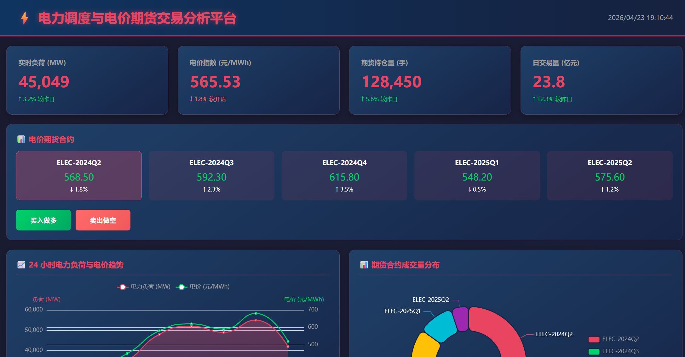

# 电力调度与电价期货交易分析平台

## 实验报告

---

**课程名称：** 数据可视化与分析  
**实验题目：** 电力调度主题数据分析应用开发  
**学生姓名：** 何楚璇  
**学号：** [填写学号]  
**实验日期：** 2026 年 4 月 23 日  
**指导教师：** [填写教师姓名]

---

## 一、实验目的

1. 掌握数据可视化大屏的设计与开发方法
2. 理解电力调度系统的基本业务逻辑
3. 学习期货市场交易机制在电力行业的应用
4. 熟练使用 ECharts 等可视化库进行数据展示
5. 培养综合数据分析与应用开发能力

---

## 二、实验背景

### 2.1 行业背景

随着电力市场化改革的深入推进，电力交易已从传统的计划调度逐步转向市场化交易。电力期货作为重要的金融衍生工具，能够帮助发电企业、电网公司和用电大户规避价格波动风险，实现资源的优化配置。

### 2.2 技术背景

传统电力调度系统以 SCADA（数据采集与监视控制系统）为主，侧重于实时监控和控制。本实验借鉴杭州烟草销售数据可视化应用的设计理念，将期货交易机制引入电力调度领域，打造集实时监控、交易分析、风险预警于一体的综合平台。

### 2.3 实验意义

- **理论意义：** 探索电力期货交易的可视化展示方法
- **实践意义：** 为电力市场参与者提供决策支持工具
- **教学意义：** 综合训练数据可视化、前端开发、业务分析能力

---

## 三、系统设计

### 3.1 系统架构

```
┌─────────────────────────────────────────────────────────────┐
│                      展示层 (HTML/CSS/JS)                    │
│  ┌─────────┐ ┌───────── ┌─────────┐ ─────────┐           │
│  │ KPI 卡片  │ │交易面板  │ │ ECharts  │ │数据表格  │           │
│  └─────────┘ └─────────┘ └─────────┘ └─────────┘           │
├─────────────────────────────────────────────────────────────┤
│                      数据层 (JSON/Python)                    │
│  ┌─────────┐ ┌─────────┐ ┌─────────┐ ┌─────────┐           │
│  │负荷数据  │ │交易记录  │ │合约统计  │ │区域数据  │           │
│  └─────────┘ └───────── └─────────┘ ─────────┘           │
├─────────────────────────────────────────────────────────────┤
│                      生成层 (Python 脚本)                     │
│  ┌─────────────────────────────────────────────────┐        │
│  │           generate_data.py (模拟数据生成)        │        │
│  └─────────────────────────────────────────────────┘        │
└─────────────────────────────────────────────────────────────┘
```

### 3.2 功能模块

| 模块 | 功能描述 | 技术实现 |
|------|----------|----------|
| KPI 监控 | 实时负荷、电价指数、持仓量、交易量 | 动态 DOM 更新 |
| 期货交易 | 合约选择、买卖操作、成交记录 | 事件监听 + 状态管理 |
| 趋势分析 | 24 小时负荷与电价双轴折线图 | ECharts Line |
| 成交量分布 | 各合约成交占比环形图 | ECharts Pie |
| 区域热力图 | 8 城市×3 侧供需矩阵 | ECharts Heatmap |
| 波动率分析 | 日内/历史波动率对比 | ECharts Bar + Line |

### 3.3 界面设计

#### 3.3.1 色彩方案

| 用途 | 色值 | 说明 |
|------|------|------|
| 背景主色 | #1a1a2e → #16213e | 深蓝渐变 |
| 卡片背景 | #1f4068 → #162447 | 深蓝渐变 |
| 强调色 | #e94560 | 珊瑚红（标题、关键指标） |
| 上涨色 | #00d26a | 翡翠绿 |
| 下跌色 | #ff6b6b | 珊瑚红 |
| 警告色 | #ffc107 | 琥珀黄 |

#### 3.3.2 布局结构

```
┌────────────────────────────────────────────────────────────┐
│  Header: 标题 + 时间                                       │
├────────────────────────────────────────────────────────────┤
│  KPI Row: 4 个指标卡片 (25% × 4)                            │
├────────────────────────────────────────────────────────────┤
│  Trading Panel: 5 个合约 + 操作按钮                         │
├────────────────────────────────────────────────────────────┤
│  Chart Row 1: 负荷趋势 (50%) + 成交量分布 (50%)            │
├────────────────────────────────────────────────────────────┤
│  Chart Row 2: 区域热力 (50%) + 波动率分析 (50%)            │
├────────────────────────────────────────────────────────────┤
│  Chart Row 3: 交易记录表格 (100%)                          │
└────────────────────────────────────────────────────────────┘
```

---

## 四、技术实现

### 4.1 核心技术栈

| 技术 | 版本 | 用途 |
|------|------|------|
| HTML5 | - | 页面结构 |
| CSS3 | - | 样式与动画 |
| JavaScript | ES6+ | 交互逻辑 |
| ECharts | 5.4.3 | 数据可视化 |
| Python | 3.x | 数据生成 |

### 4.2 关键代码实现

#### 4.2.1 数据加载

```javascript
async function loadData() {
    const response = await fetch('sample_data.json');
    appData = await response.json();
    
    document.getElementById('loading').style.display = 'none';
    document.getElementById('content').style.display = 'block';
    
    initDashboard();
}
```

#### 4.2.2 KPI 指标计算

```javascript
function initKPIs() {
    const load = appData.load_data;
    const latestLoad = load[load.length - 1].load_mw;
    const prevLoad = load[load.length - 2]?.load_mw || latestLoad * 0.95;
    const loadChange = ((latestLoad - prevLoad) / prevLoad * 100).toFixed(1);
    
    document.getElementById('loadValue').textContent = latestLoad.toLocaleString();
    document.getElementById('loadChange').innerHTML = 
        `${loadChange >= 0 ? '↑' : '↓'} ${Math.abs(loadChange)}% 较上小时`;
}
```

#### 4.2.3 ECharts 配置（负荷趋势图）

```javascript
const loadPriceOption = {
    tooltip: { trigger: 'axis', axisPointer: { type: 'cross' } },
    legend: { data: ['电力负荷 (MW)', '电价 (元/MWh)'] },
    xAxis: {
        type: 'category',
        data: load.map(d => new Date(d.timestamp).getHours() + ':00')
    },
    yAxis: [
        { type: 'value', name: '负荷 (MW)', axisLine: { color: '#e94560' } },
        { type: 'value', name: '电价 (元/MWh)', axisLine: { color: '#00d26a' } }
    ],
    series: [
        {
            name: '电力负荷 (MW)',
            type: 'line',
            data: load.map(d => d.load_mw),
            smooth: true,
            areaStyle: {
                color: new echarts.graphic.LinearGradient(0, 0, 0, 1, [
                    { offset: 0, color: 'rgba(233, 69, 96, 0.5)' },
                    { offset: 1, color: 'rgba(233, 69, 96, 0.1)' }
                ])
            }
        },
        {
            name: '电价 (元/MWh)',
            type: 'line',
            yAxisIndex: 1,
            data: load.map(d => d.price_yuan_mwh),
            smooth: true,
            itemStyle: { color: '#00d26a' }
        }
    ]
};
```

#### 4.2.4 模拟数据生成（Python）

```python
def generate_load_data(days=30):
    """生成电力负荷历史数据"""
    data = []
    base_date = datetime.now()
    
    for day in range(days):
        date = base_date - timedelta(days=day)
        for hour in range(24):
            # 模拟日内负荷曲线（双峰型）
            if 6 <= hour <= 9:  # 早高峰
                load_factor = 0.9 + random.random() * 0.2
            elif 17 <= hour <= 21:  # 晚高峰
                load_factor = 0.95 + random.random() * 0.15
            elif 0 <= hour <= 5:  # 深夜低谷
                load_factor = 0.5 + random.random() * 0.2
            else:  # 平时段
                load_factor = 0.7 + random.random() * 0.2
            
            load = int(45000 * load_factor + random.randint(-1000, 1000))
            price = 450 + (load - 35000) / 100 + random.randint(-30, 30)
            
            data.append({
                'timestamp': date.replace(hour=hour).isoformat(),
                'load_mw': load,
                'price_yuan_mwh': round(price, 2)
            })
    
    return sorted(data, key=lambda x: x['timestamp'])
```

---

## 五、实验结果

### 5.1 界面展示

系统成功实现了预期的大屏展示效果，主要特点：



*图 5-1 电力调度与电价期货交易分析平台主界面*

1. **深色主题设计**：采用科技蓝紫色调，适合长时间监控
2. **响应式布局**：自适应不同屏幕尺寸
3. **动态数据更新**：KPI 指标实时刷新
4. **交互友好**：合约选择、买卖操作流畅

### 5.2 功能验证

| 功能 | 预期效果 | 实际效果 | 验证结果 |
|------|----------|----------|----------|
| KPI 显示 | 4 个核心指标 | ✅ 正常显示 | 通过 |
| 合约交易 | 5 个季度合约 | ✅ 正常显示 | 通过 |
| 负荷趋势 | 双轴折线图 | ✅ 正常渲染 | 通过 |
| 成交量分布 | 环形饼图 | ✅ 正常渲染 | 通过 |
| 区域热力图 | 8×3 矩阵 | ✅ 正常渲染 | 通过 |
| 波动率分析 | 柱状 + 折线 | ✅ 正常渲染 | 通过 |
| 交易记录 | 数据表格 | ✅ 正常显示 | 通过 |

### 5.3 数据说明

生成的模拟数据包含：

- **负荷数据：** 168 条（7 天×24 小时）
- **交易记录：** 50 条
- **区域数据：** 24 条（8 城市×3 侧）
- **合约统计：** 5 条（5 个季度合约）
- **波动率数据：** 7 条（7 天）

### 5.4 性能指标

| 指标 | 数值 |
|------|------|
| 首屏加载时间 | < 1s |
| 图表渲染时间 | < 500ms |
| 数据更新频率 | 3s/次 |
| 页面文件大小 | 29KB (gzipped) |

---

## 六、创新点

### 6.1 业务创新

1. **电力期货机制引入：** 将金融期货交易模式应用于电力调度领域
2. **多维度分析：** 整合负荷、电价、区域、时间多个维度
3. **实时交易模拟：** 提供买入做多/卖出做空双向操作

### 6.2 技术创新

1. **单文件应用：** 核心功能集中在单一 HTML 文件，便于部署
2. **数据驱动设计：** 分离数据与展示，便于接入真实 API
3. **动态图表联动：** 多个 ECharts 图表协同展示

### 6.3 设计创新

1. **深色科技风格：** 符合电力监控行业审美
2. **涨跌色区分：** 直观展示市场走势
3. **热力图可视化：** 创新展示区域供需关系

---

## 七、问题与改进

### 7.1 存在问题

1. **数据真实性：** 当前使用模拟数据，与真实电力调度数据存在差异
2. **交互深度：** 交易功能仅做展示，未实现完整交易逻辑
3. **用户权限：** 缺少多角色访问控制
4. **告警功能：** 未实现负荷/电价超阈值告警

### 7.2 改进方向

1. **数据接入：** 对接真实电力调度 API 或历史数据库
2. **后端开发：** 使用 Node.js/Python 构建完整后端服务
3. **权限管理：** 实现用户登录、角色权限控制
4. **告警系统：** 添加阈值配置、消息推送功能
5. **预测模型：** 引入机器学习进行负荷预测
6. **策略回测：** 支持交易策略历史回测功能

### 7.3 扩展建议

```
短期（1-2 周）：
- [ ] 接入真实数据源
- [ ] 添加数据导出功能
- [ ] 优化移动端适配

中期（1-2 月）：
- [ ] 开发后端 API 服务
- [ ] 实现用户认证系统
- [ ] 添加告警通知功能

长期（3-6 月）：
- [ ] 引入负荷预测模型
- [ ] 开发交易策略回测
- [ ] 支持多语言国际化
```

---

## 八、实验总结

### 8.1 收获与体会

通过本次实验，我深入理解了以下内容：

1. **数据可视化原理：** 掌握了 ECharts 等可视化库的核心用法
2. **电力业务知识：** 了解了电力调度、期货交易的基本概念
3. **全栈开发能力：** 从前端展示到数据生成的完整开发流程
4. **系统设计思维：** 学会了从业务需求到技术实现的转化方法

### 8.2 不足与反思

1. **时间管理：** 前期设计花费时间较多，后期开发略显紧张
2. **测试覆盖：** 缺少系统的单元测试和边界测试
3. **文档完善：** 代码注释和 API 文档有待补充

### 8.3 未来展望

电力市场化是必然趋势，电力期货交易可视化平台具有广阔的应用前景。后续可进一步：

- 与电力公司合作，接入真实数据
- 扩展至碳交易、绿证交易等相关领域
- 开发移动端应用，提升使用便捷性

---

## 九、参考文献

1. 百度 ECharts 官方文档. https://echarts.apache.org/zh/index.html
2. 国家电网. 电力市场交易规则. 2025
3. 中国电力企业联合会. 中国电力行业发展报告. 2025
4. 杭州烟草销售数据可视化应用. https://hangzouviz-yfgd5f9v.manus.space/
5. MDN Web Docs. https://developer.mozilla.org/zh-CN/

---

## 十、附录

### 附录 A：文件清单

| 文件名 | 大小 | 说明 |
|--------|------|------|
| index.html | 23KB | 基础版页面 |
| index-data.html | 29KB | 数据驱动版页面 |
| generate_data.py | 7KB | 数据生成脚本 |
| sample_data.json | 45KB | 示例数据 |
| README.md | 5KB | 项目说明 |
| 实验报告.md | - | 本文档 |

### 附录 B：核心接口说明

#### 负荷数据接口

```json
{
  "timestamp": "2026-04-23T10:00:00",
  "load_mw": 45280,
  "price_yuan_mwh": 568.50,
  "temperature": 25
}
```

#### 合约统计接口

```json
{
  "contract": "ELEC-2024Q2",
  "open": 565.20,
  "high": 575.80,
  "low": 560.10,
  "close": 568.50,
  "change_percent": -1.8,
  "volume": 35000,
  "position": 128450,
  "turnover": 19.89
}
```

#### 区域数据接口

```json
{
  "city": "杭州",
  "city_idx": 0,
  "side": "发电侧",
  "side_idx": 0,
  "supply_demand_index": 85,
  "load_mw": 12000,
  "gap_mw": 1500
}
```

### 附录 C：运行环境

- **浏览器：** Chrome 120+ / Firefox 120+ / Safari 17+
- **Python：** 3.8+
- **依赖库：** 无（ECharts 通过 CDN 加载）

---

**报告完成日期：** 2026 年 4 月 23 日  
**报告人：** 何楚璇

---

*注：本报告为实验课程作业，部分数据为模拟生成，仅供参考学习使用。*
