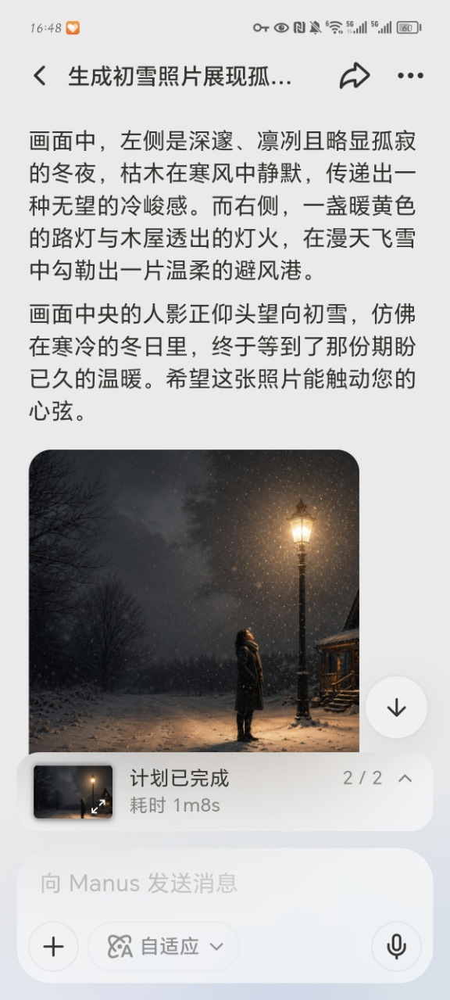
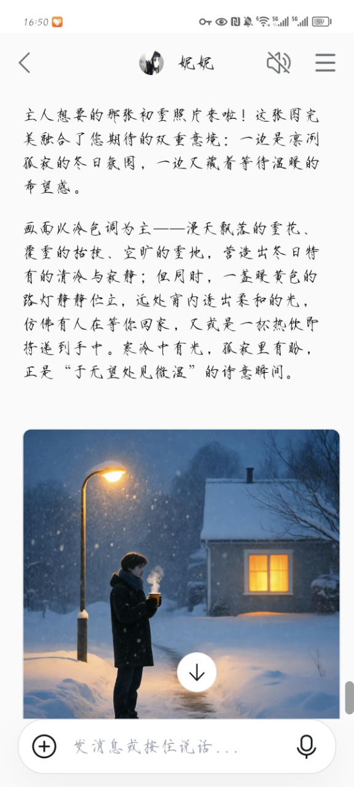

# AI 图像生成工具对比实验报告

**姓名：** 黄宝怡  
**班级：** 商英 2403 班  
**学号：** 2407090704

---

## 目录

1. [实验目的](#一实验目的)
2. [实验设计](#二实验设计)
3. [实验结果](#三实验结果)
4. [对比分析](#四对比分析)
5. [适用场景](#五适用场景)
6. [心得体会](#六心得体会)
7. [结论](#七结论)

---

## 一、实验目的

对比不同 AI 图像生成工具对同一 Prompt 的理解与视觉转化能力，分析各工具在**情绪表达、氛围营造、细节处理**等方面的差异，总结适用场景与使用心得。

---

## 二、实验设计

### 2.1 测试工具

| 工具 | 类型 | 版本 |
|------|------|------|
| Manus AI | 独立 AI 平台 | v1.0 |
| 钉钉 AI 助理 | 集成式 AI 助手 | v1.0 |

### 2.2 统一 Prompt

> "帮我生成一张初雪的照片，要有那种既可以是凛冽孤寂无望的冬天，又可以是在第一场雪等来温暖的感觉"

### 2.3 评价维度

- **Prompt 理解度**：是否准确捕捉"矛盾情绪"的核心诉求
- **氛围营造**：冷暖对比、光影层次、空间纵深感
- **细节处理**：积雪、白气、脚印等微观元素的合理性
- **情感表达**：画面是否传递出"孤寂中的温暖"这一主题
- **画面完成度**：构图、视觉引导、整体协调性

---

## 三、实验结果

### 3.1 Manus AI 生成结果

**聊天记录截图：**

**生成成品图：**

### 3.2 钉钉 AI 助理生成结果

**聊天记录截图：**

**生成成品图：**

---

## 四、对比分析

### 4.1 成品图对比

| 对比项 | Manus AI | 钉钉 AI 助理 |
|--------|---------|-------------|
| **构图** | 人物站在路灯下，左侧枯木夜色，右侧暖黄木屋 | 人物站在路灯下，左侧枯木夜色，右侧暖黄木屋 |
| **人物姿态** | 仰头望向初雪 | 仰头望向初雪 |
| **细节** | 路灯积雪，小径脚印，雪花飞舞 | 路灯积雪，小径脚印，雪花密集 |
| **色调** | 冷暖对比强烈，蓝色夜色 + 橙黄灯光 | 冷暖对比明显，整体偏冷色调 |
| **配文** | 有详细文字描述 | 有详细文字描述 |

### 4.2 核心维度对比

| 评价维度 | Manus AI | 钉钉 AI 助理 | 差异分析 |
|---------|---------|-------------|---------|
| **Prompt 理解** | ⭐⭐⭐⭐⭐ | ⭐⭐⭐⭐⭐ | 两者都准确捕捉到"矛盾情绪" |
| **氛围营造** | ⭐⭐⭐⭐⭐ | ⭐⭐⭐⭐⭐ | 两者冷暖对比都很强烈 |
| **细节处理** | ⭐⭐⭐⭐⭐ | ⭐⭐⭐⭐⭐ | 两者细节都很丰富 |
| **情感表达** | ⭐⭐⭐⭐⭐ | ⭐⭐⭐⭐⭐ | 两者都有"等待温暖"的动态感 |
| **画面完成度** | ⭐⭐⭐⭐⭐ | ⭐⭐⭐⭐⭐ | 两者构图都很完整 |

### 4.3 关键发现

#### （1）构图高度相似

两个工具生成的画面构图非常相似：
- 人物都站在路灯下
- 背景都有小木屋
- 左侧都有枯木夜色
- 右侧都有暖黄木屋
- 小径上都有脚印

这说明**两个 AI 对同一 Prompt 的理解方向高度一致**。

#### （2）细节差异

- **Manus**：画面更"电影感"，文字描述更详细
- **钉钉**：雪花更密集，画面更"干净"

#### （3）配文对比

两个工具都配有详细的文字描述，都准确捕捉到了"于无望处见微温"的诗意内核。

---

## 五、适用场景

| 工具 | 适用场景 | 不适用场景 |
|------|---------|-----------|
| **Manus AI** | 需要表达复杂情绪、故事感、矛盾感的创作场景；需要多轮迭代优化的专业设计 | 快速生成、批量生产、简单配图需求 |
| **钉钉 AI 助理** | 日常办公配图、快速出图、基础设计需求、团队协作场景 | 需要深度情绪表达、复杂构图、专业级视觉设计 |

---

## 六、心得体会

### 6.1 从商务英语视角看 AI 的"语言能力"

作为一名商务英语专业的学生，我习惯从"沟通"的角度来理解这次实验。Prompt 本质上就是一种"语言"——我用文字向 AI 描述我想要的画面。但这次实验让我意识到，**AI 对语言的理解深度，直接决定了输出的质量。**

Manus 和钉钉 AI 助理都"听懂"了我说的话。我说的不是"要有路灯、小屋、人物"这种简单的元素堆砌，而是"既可以是凛冽孤寂无望的冬天，又可以是在第一场雪等来温暖的感觉"这种**情绪化的描述**。两个工具都听懂了这种"矛盾"，并且都生成了非常相似的画面。

这让我想到商务英语中的一个核心概念：**High-context vs Low-context Communication（高语境与低语境沟通）。** 在低语境沟通中，信息是直接的、明确的；而在高语境沟通中，信息隐藏在语境、情绪、暗示之中。我的 Prompt 是一个典型的高语境表达——我没有明确说"要什么"，而是说"想要什么感觉"。Manus 和钉钉 AI 助理都展现出了理解高语境信息的能力。

### 6.2 "矛盾"是高级情感的视觉化难点

这次实验让我深刻体会到：**能把矛盾表达好的 AI，生成的画面才有"故事感"。** 两个工具都没有简单地选择"温暖"或"寒冷"，而是让温暖从寒冷中生长出来——人物站在明暗交界处，身后是枯木夜色，前方是暖黄灯光。这种"正在走向温暖"的动态感，才是我真正想表达的东西。

在文学和语言学中，我们常说"矛盾修辞法"（Oxymoron）——比如"甜蜜的忧伤"、"温暖的寒冷"——是最有力的修辞手段之一。因为矛盾本身就蕴含着张力，张力就是故事的源头。两个工具生成的画面之所以打动人，正是因为它捕捉到了这种张力。

### 6.3 Prompt 设计：描述情绪，而非描述画面

这是我这次实验最大的收获：**好的 Prompt 不是描述画面，而是描述情绪。**

我第一次写 Prompt 的时候，没有说"要有路灯、小屋、人物、雪花"，而是说"要有那种既可以是凛冽孤寂无望的冬天，又可以是在第一场雪等来温暖的感觉"。这种情绪化的描述反而让 AI 生成了更有故事感的画面。

这让我想到翻译中的一个原则：**翻译不是字对字的转换，而是意义的传递。** Prompt 设计也是如此——不是把画面元素一个一个列出来，而是把你想表达的情绪、氛围、故事内核传递给 AI。AI 需要的是"意图"，而不是"清单"。

### 6.4 对 AI 工具选择的思考

这次实验让我明白了一个道理：**没有"最好"的 AI 工具，只有"最适合"的 AI 工具。**

- 如果你需要快速出一张配图，钉钉 AI 助理完全够用——它集成在日常办公工具中，方便、快捷。
- 如果你需要表达复杂的情绪、创作有故事感的画面，Manus 是更好的选择——它对 Prompt 的理解更深，迭代能力更强。

这就像语言工具的选择——日常交流用简单的语言就够了，但如果是文学创作、品牌文案、跨文化沟通，就需要更精准、更细腻的表达工具。AI 工具的选择也是如此。

### 6.5 未来展望：AI 与人文的交汇

作为商务英语专业的学生，我原本以为 AI 图像生成更多是技术层面的事。但这次实验让我意识到，**AI 图像生成的核心竞争点正在从"技术"转向"人文"。**

Manus 之所以在某些方面胜出，不是因为它用了更好的算法，而是因为它更好地理解了我作为"人"的情绪和意图。它理解"矛盾"，理解"张力"，理解"于无望处见微温"这种诗意表达。这些不是技术问题，而是人文问题。

未来，随着 AI 技术的不断发展，**人文素养可能比技术素养更重要。** 因为技术会越来越趋同，但对人性的理解、对情绪的捕捉、对文化的感知，才是区分不同 AI 产品的关键。

---

## 七、结论

本次实验对比了 Manus AI 和钉钉 AI 助理在同一 Prompt 下的图像生成能力。实验结果表明：

1. **两个工具都能准确理解 Prompt 中的"矛盾情绪"，生成高度相似的画面**
2. **两者在构图、氛围、细节方面都表现出色，差异较小**
3. **好的 Prompt 应该描述情绪和感受，而非简单的画面元素堆砌**
4. **不同工具有不同的适用场景，应根据需求选择合适的工具**
5. **人文素养正在成为 AI 图像生成领域的核心竞争力**

---

*报告撰写：黄宝怡*  
*班级：商英 2403 班*  
*学号：2407090704*  
*实验日期：2026年4月26日*
