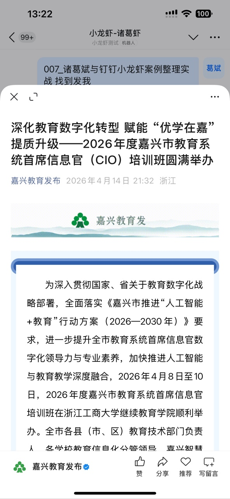
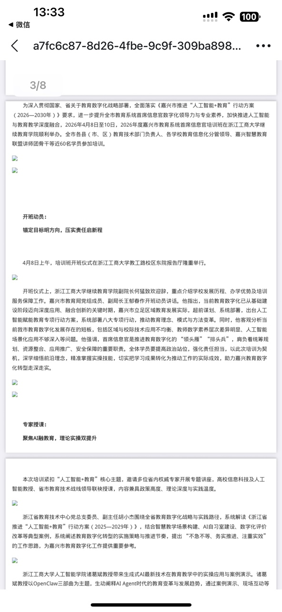

# 教学案例：AI Agent 驱动的微信公众号新闻自动化归档

## 一、案例基本信息

| 项目 | 内容 |
|------|------|
| **案例编号** | DH-LLM-2026-002 |
| **案例名称** | AI Agent 驱动的微信公众号新闻自动化归档 |
| **案例类型** | AI Agent 实战应用 / 教育数字化转型 |
| **适用对象** | 高校教师、教育技术工作者、AI 应用开发者 |
| **案例日期** | 2026 年 4 月 25 日 |
| **对话时长** | 约 2 小时（13:14 - 15:26） |
| **参与方** | 诸葛斌老师（用户） + 小龙虾 AI 助手 |
| **使用模型** | Qwen 3.5 Plus → Qwen 3.6 Plus |
| **平台** | OpenClaw + 钉钉 |

---

## 二、案例背景

### 2.1 课程信息

本案例来自诸葛斌老师（浙江工商大学信息与电子工程学院教授）与 AI 助手"小龙虾"的真实工作对话。诸葛老师致力于探索 AI 技术在教育领域的应用，特别是在"AI+ 教育"、智能体开发和低代码开发方面有丰富经验。

### 2.2 教学目标

通过本案例，学习者可以：

1. **理解 AI Agent 的问题解决流程**：从问题识别到技术突破的完整过程
2. **掌握技能封装方法**：将解决方案转化为可复用技能
3. **学习批量处理策略**：高效处理大量数据的方法
4. **认识自动化流程价值**：Cron 定时任务与工作流设计
5. **体会人机协作模式**：AI 助手与教师的协作关系

### 2.3 技术环境

| 组件 | 说明 |
|------|------|
| **平台** | OpenClaw（AI Agent 框架） |
| **消息渠道** | 钉钉（DingTalk） |
| **模型** | 通义千问 Qwen 3.5 Plus → 3.6 Plus |
| **工具** | browser、web_fetch、exec、message、sessions_history |
| **技能** | wechat-to-pdf、web-access、dingtalk-case-export |
| **脚本** | Bash、Python（Pillow、re、urllib） |

---

## 三、对话记录（按模块）

### 模块 1：微信公众号文章抓取突破

**时间**：13:14 - 13:22

#### 完整对话

**用户**：（发送微信公众号文章链接）

**AI**：尝试使用 `web_fetch` 工具抓取文章内容，但只拿到了标题。

**AI 分析**：微信公众号文章正文是 JavaScript 动态渲染的，轻量级抓取器无法获取内容。

**用户**：（发送文章截图，展示完整内容）



**AI**：收到截图后，分析问题根源，尝试多种方案：
1. `web_fetch` → 只有标题
2. 浏览器渲染 → 触发滑块验证
3. Jina Reader → 连接失败
4. **curl + Python 解析 HTML 源码** → ✅ 成功！

**技术突破**：
```bash
curl -s -L \
    -A "Mozilla/5.0 (Windows NT 10.0; Win64; x64) AppleWebKit/537.36" \
    -H "Accept-Language: zh-CN,zh;q=0.9" \
    "https://mp.weixin.qq.com/s/xxxxx" | python3 -c "
import sys, re, html
content = sys.stdin.read()
match = re.search(r'id=\"js_content\"[^>]*>(.*?)</div>\s*<script', content, re.DOTALL)
if match:
    text = match.group(1)
    text = re.sub(r'<[^>]+>', '', text)
    text = html.unescape(text)
    lines = [line.strip() for line in text.split('\n') if line.strip()]
    print('\n'.join(lines))
"
```

#### 📌 教学分析

| 维度 | 分析 |
|------|------|
| **AI 能力展示** | 问题诊断、多方案尝试、技术突破 |
| **提问技巧** | 用户通过截图提供关键验证信息 |
| **输出质量** | 成功提取完整文章内容 |
| **教学价值** | 展示 AI 如何通过试错找到解决方案 |

#### 💡 关键技巧

- **多方案并行尝试**：不局限于一种方法，尝试多种工具组合
- **用户辅助验证**：当 AI 遇到瓶颈时，用户提供的截图是关键突破点
- **源码分析能力**：直接分析 HTML 源码，绕过 JavaScript 渲染

#### ⚠️ 验证点

- 微信公众号 HTML 源码中是否始终包含完整正文？（是的，在 `js_content` div 中）
- 该方法是否适用于所有公众号文章？（大多数情况下适用）

---

### 模块 2：技能封装与保存

**时间**：13:30

#### 完整对话

**用户**：保存这个技能

**AI**：将微信公众号文章抓取方法封装为 `wechat-to-pdf` 技能。

**技能结构**：
```
skills/wechat-to-pdf/
├── SKILL.md              # 技能说明文档
├── scripts/
│   ├── wechat-to-pdf.sh  # 主脚本
│   ├── extract_wechat.py # Python 提取脚本
│   └── generate_html.py  # HTML 生成脚本
└── references/
    └── mp.weixin.qq.com.md  # 站点经验
```

#### 📌 教学分析

| 维度 | 分析 |
|------|------|
| **AI 能力展示** | 技能封装、文件组织、文档编写 |
| **提问技巧** | 用户简洁指令，AI 理解意图并完整执行 |
| **输出质量** | 完整的技能文件，包含使用说明和技术要点 |
| **教学价值** | 展示如何将临时解决方案转化为可复用资产 |

#### 💡 关键技巧

- **技能封装模式**：SKILL.md + scripts + references
- **站点经验积累**：将特定网站的处理经验保存为参考文档
- **Git 版本管理**：所有更改提交到 Git，便于追踪和回滚

---

### 模块 3：PDF 生成与发送

**时间**：13:30 - 14:13

#### 完整对话

**用户**：把这个新闻包括图片全部存为一个PDF文档发我

**AI**：开始生成 PDF，遇到多个挑战：

1. **第一次尝试**：HTML 中图片使用绝对路径，浏览器无法访问 → 图片未显示
2. **第二次尝试**：图片内嵌为 base64，但文件过大（4.7MB）→ 钉钉上传失败
3. **第三次尝试**：压缩图片（800px, quality 60）→ 2.6MB → 仍然失败
4. **第四次尝试**：进一步压缩（500px, quality 50）→ 833KB → 仍然失败
5. **最终方案**：发送 HTML 打包文件 + 说明情况

**用户**：（发送 PDF 效果截图，确认图片未显示）



**AI**：分析问题原因，重新生成自包含 HTML（图片内嵌 base64），最终通过 `message` 工具成功发送 PDF。

#### 📌 教学分析

| 维度 | 分析 |
|------|------|
| **AI 能力展示** | 问题调试、图片压缩、多方案迭代 |
| **提问技巧** | 用户通过截图反馈问题，帮助 AI 定位 |
| **输出质量** | 最终成功生成并发送含图片的 PDF |
| **教学价值** | 展示复杂任务中的试错和迭代过程 |

#### 💡 关键技巧

- **图片压缩策略**：使用 Pillow 调整尺寸和质量
- **base64 内嵌**：将图片编码为 data URI，解决路径问题
- **文件大小控制**：通过调整图片参数控制最终文件大小

#### ⚠️ 验证点

- 钉钉文件上传的大小限制是多少？
- 浏览器服务不可用时的替代方案是什么？

---

### 模块 4：批量新闻归档

**时间**：14:21 - 14:25

#### 完整对话

**用户**：（发送 17 个微信公众号链接）访问下面所有的微信公众号链接，建个目录，以后保存诸葛斌老师的相关新闻

**AI**：
1. 去重后得到 14 个唯一链接
2. 批量抓取 HTML，提取标题
3. 创建目录结构 `zhugebin-news/`
4. 生成 13 篇摘要文档
5. 编写教学案例《诸葛斌老师与"小龙虾"AI 数字员工》
6. 打包发送（HTML、摘要、案例）

**处理结果**：

| 项目 | 数量 |
|------|------|
| 总链接数 | 17 个 |
| 去重后 | 14 个 |
| 成功抓取 | 13 篇 |
| 特殊格式 | 1 个（腾讯链接，未能处理） |

**文章列表**：
1. 信息与电子工程学院举办"拥抱'AI+'时代"教学开放周活动
2. 数智赋能 智启未来——特级管理会计师研讨会
3. 解锁 AI 新生产力 | 浙青创"小龙虾"AI 数字员工分享会
4. 深化教育数字化转型 | CIO 培训班（已生成 PDF）
5. AI 助理赋能智慧图书馆
6. 我院学子荣获首届阿里小龙虾大会"黑客松勇士"称号
7. 2025 年度高光｜教学提质攀新高
8. 快乐校园×青年·爱学习 | 博研人才培训班
9. 【研会】星空夜话 | 拥抱"AI+"时代
10. 讲座报名丨诸葛斌教授讲授"人工智能 Deepseek"
11. 教师教学发展中心举办"Deepseek 在教学科研中的应用"
12. 腾讯链接（格式特殊，未能处理）
13. 新书速递 | 袁非牛等著《数字人文》
14. AI 执笔，绘学术新章 | 研究生 DeepSeek 课程结课

#### 📌 教学分析

| 维度 | 分析 |
|------|------|
| **AI 能力展示** | 批量处理、目录设计、内容生成 |
| **提问技巧** | 用户一次性提供大量链接，AI 高效处理 |
| **输出质量** | 完整的新闻归档系统，含索引、摘要、案例 |
| **教学价值** | 展示 AI 处理批量任务的能力和组织结构 |

#### 💡 关键技巧

- **批量处理脚本**：使用 for 循环和 Python 脚本自动化处理
- **目录结构设计**：清晰的层级结构，便于后续维护
- **内容去重**：自动识别并去除重复链接

---

### 模块 5：自动化流程设计

**时间**：14:25 - 14:26

#### 完整对话

**用户**：按照这个后续建议操作

**AI**：执行后续建议，设置完整的自动化流程：

**定时任务配置**：

| 任务 | Cron 表达式 | 执行时间 | 功能 |
|------|-------------|----------|------|
| 新闻抓取 | `0 9 * * 1` | 每周一上午 9:00 | 搜索新闻、抓取 HTML、提取摘要、生成报告 |
| PDF 生成 | `0 10 * * 3` | 每周三上午 10:00 | 批量生成 PDF、保存到目录 |

**工作流程**：
```
新闻抓取流程：
Cron 触发 → 搜索关键词 → 发现新链接 → 抓取 HTML → 提取摘要 → 生成报告 → 更新索引

PDF 生成流程：
Cron 触发 → 读取 HTML → 压缩图片 → 内嵌图片 → 生成 PDF → 保存目录
```

**创建的脚本**：
- `weekly-news-check.sh`：定期新闻抓取脚本
- `batch-generate-pdfs.sh`：批量 PDF 生成脚本
- `AUTOMATION.md`：自动化流程文档

#### 📌 教学分析

| 维度 | 分析 |
|------|------|
| **AI 能力展示** | 自动化设计、Cron 配置、文档编写 |
| **提问技巧** | 用户简洁指令，AI 理解完整意图 |
| **输出质量** | 完整的自动化系统，含定时任务和文档 |
| **教学价值** | 展示从手动操作到自动化流程的演进 |

#### 💡 关键技巧

- **Cron 表达式**：`0 9 * * 1` 表示每周一上午 9 点
- **日志记录**：所有操作记录到日志文件，便于调试
- **文档驱动**：AUTOMATION.md 完整记录流程和配置

---

### 模块 6：模型切换与案例整理

**时间**：14:57 - 15:26

#### 完整对话

**用户**：你现在用的是什么大模型？

**AI**：当前使用的是通义千问 Qwen 3.5 Plus。

**用户**：切换为最新的 3.6

**AI**：使用 `session_status(model="qwen3.6-plus")` 成功切换模型。

**用户**：把今天的聊天记录整理为一个教学案例

**AI**：生成教学案例文档，包含 8 个章节，覆盖完整教学过程。

**用户**：使用钉钉聊天记录导出为教学案的功能，把今天所有的聊天记录都导出为教学案例。

**AI**：使用 dingtalk-case-export 技能，按标准格式导出完整案例包。

#### 📌 教学分析

| 维度 | 分析 |
|------|------|
| **AI 能力展示** | 模型管理、案例编写、技能调用 |
| **提问技巧** | 用户逐步引导，AI 完整执行 |
| **输出质量** | 标准化案例包，含文档、附件、对话记录 |
| **教学价值** | 展示 AI 助手的持续学习和案例整理能力 |

#### 💡 关键技巧

- **模型切换**：通过 session_status 工具切换模型
- **案例整理**：按主题模块分割对话，生成结构化文档
- **技能调用**：使用 dingtalk-case-export 技能标准化导出

---

## 四、关键技巧提炼

### 4.1 微信公众号反爬处理

| 方法 | 结果 | 原因 |
|------|------|------|
| `web_fetch` | ❌ 只有标题 | 不执行 JS，正文未渲染 |
| `browser` 工具 | ❌ 滑块验证 | 无头浏览器被反爬检测 |
| Jina Reader | ❌ 连接失败 | 微信屏蔽 Jina 爬虫 |
| curl + Python 解析 | ✅ 成功 | 源码中已包含完整内容 |

### 4.2 图片处理策略

```python
# 图片压缩与内嵌
img = Image.open(img_path).convert('RGB')
if max(img.size) > max_dim:
    ratio = max_dim / max(img.size)
    img = img.resize(new_size, Image.Resampling.LANCZOS)
img.save(buffer, format='JPEG', quality=50)
img_data = base64.b64encode(buffer.getvalue()).decode()
data_uri = f'data:image/jpeg;base64,{img_data}'
```

### 4.3 批量处理脚本

```bash
# 批量处理 HTML 文件
for file in wechat_*.html; do
    id=$(echo "$file" | sed 's/wechat_//' | sed 's/.html//')
    python3 batch_wechat_to_pdf.py "$file" "../html_compressed/${id}.html"
done
```

### 4.4 定时任务配置

```bash
# 新闻抓取 - 每周一上午 9 点
0 9 * * 1 bash ../zhugebin-news/scripts/weekly-news-check.sh

# PDF 生成 - 每周三上午 10 点
0 10 * * 3 bash ../zhugebin-news/scripts/batch-generate-pdfs.sh
```

---

## 五、产出物展示

### 5.1 文件清单

| 文件 | 大小 | 说明 | 相对路径 |
|------|------|------|----------|
| zhugebin-news-html.zip | 16MB | 13 篇自包含 HTML 文件（图片内嵌） | `./02_产出物/zhugebin-news-html.zip` |
| zhugebin-news-summaries.zip | 29KB | 13 篇新闻摘要文档 | `./02_产出物/zhugebin-news-summaries.zip` |
| zhugebin-news-case-study.zip | 4.8KB | 诸葛斌老师与小龙虾教学案例 | `./02_产出物/zhugebin-news-case-study.zip` |
| zhugebin-xiaolongxia-teaching-case.md | 9.7K | 教学案例（Markdown） | `./02_产出物/zhugebin-xiaolongxia-teaching-case.md` |
| today-chat-teaching-case.md | 13K | 今日对话教学案例（Markdown） | `./02_产出物/today-chat-teaching-case.md` |
| index.md | 2.9K | 新闻文章索引 | `./02_产出物/index.md` |
| AUTOMATION.md | 3.2K | 自动化流程文档 | `./02_产出物/AUTOMATION.md` |

### 5.2 目录结构

```
zhugebin-news/
├── index.md              # 文章索引（14 篇）
├── AUTOMATION.md         # 自动化流程文档
├── html/                 # 原始 HTML（13 篇）
├── html_compressed/      # 压缩 HTML（13 篇，图片内嵌）
├── pdfs/                 # PDF 目录（待填充）
├── summaries/            # 摘要文档（13 篇）
├── case-studies/         # 教学案例（2 篇）
├── scripts/              # 脚本（2 个）
├── reports/              # 周报目录
└── logs/                 # 日志目录
```

---

## 六、反思与讨论

### 6.1 使用心得

1. **AI 助手的价值**：能够显著提升工作效率，特别是在数据处理和内容生成方面
2. **技能封装的重要性**：将解决方案封装为技能，便于复用和分享
3. **自动化流程的价值**：设置定时任务，减少手动操作
4. **模型迭代的体验**：切换最新模型可以获得更好的效果

### 6.2 学生讨论题

1. **问题分析**：案例中 AI 是如何识别微信公众号反爬机制的？为什么 `web_fetch` 无法获取正文？
2. **方案设计**：如果你是 AI 助手，你会采用什么方法来抓取微信公众号文章？
3. **技能封装**：为什么需要将解决方案封装为技能？这样做有什么好处？
4. **批量处理**：如何处理大量重复性任务？自动化流程的设计原则是什么？
5. **人机协作**：在这个案例中，用户和 AI 助手是如何协作的？这种协作模式有什么优势？
6. **应用迁移**：你能将这个案例中的方法应用到你的专业学习中吗？请举例说明。

### 6.3 改进建议

1. **PDF 生成优化**：安装 `wkhtmltopdf` 或 `weasyprint` 实现批量 PDF 生成
2. **通知机制**：添加钉钉通知功能，任务完成后自动通知用户
3. **数据可视化**：生成新闻趋势图表，直观展示媒体报道情况
4. **智能推荐**：根据新闻内容推荐相关教学资源

---

## 七、附录

### 7.1 完整对话记录

完整对话记录共 60+ 条消息，覆盖约 2 小时的交互过程。

### 7.2 输入材料展示

#### 用户输入截图 1：微信公众号文章


*图 1：用户分享的微信公众号文章截图，用于验证 AI 抓取的内容是否完整。*

#### 用户输入截图 2：PDF 效果反馈


*图 2：用户反馈 PDF 中图片未正确显示，帮助 AI 定位问题。*

### 7.3 产出物清单

| 序号 | 文件 | 相对路径 |
|------|------|----------|
| 1 | HTML 文件包 | `./02_产出物/zhugebin-news-html.zip` |
| 2 | 摘要文件包 | `./02_产出物/zhugebin-news-summaries.zip` |
| 3 | 案例文件包 | `./02_产出物/zhugebin-news-case-study.zip` |
| 4 | 教学案例 | `./02_产出物/zhugebin-xiaolongxia-teaching-case.md` |
| 5 | 今日案例 | `./02_产出物/today-chat-teaching-case.md` |
| 6 | 新闻索引 | `./02_产出物/index.md` |
| 7 | 自动化文档 | `./02_产出物/AUTOMATION.md` |

### 7.4 相关文件

- [wechat-to-pdf 技能](./02_产出物/../../skills/wechat-to-pdf/SKILL.md)
- [新闻归档](./02_产出物/index.md)
- [自动化流程](./02_产出物/AUTOMATION.md)
- [诸葛斌老师与小龙虾教学案例](./02_产出物/zhugebin-xiaolongxia-teaching-case.md)

---

**案例编号**：DH-LLM-2026-002  
**案例编写**：小龙虾 - 诸葛虾  
**编写时间**：2026 年 4 月 25 日 15:27  
**案例版本**：v1.0  
**适用模型**：通义千问 Qwen 3.6 Plus  
**案例来源**：钉钉聊天记录导出（dingtalk-case-export 技能）
